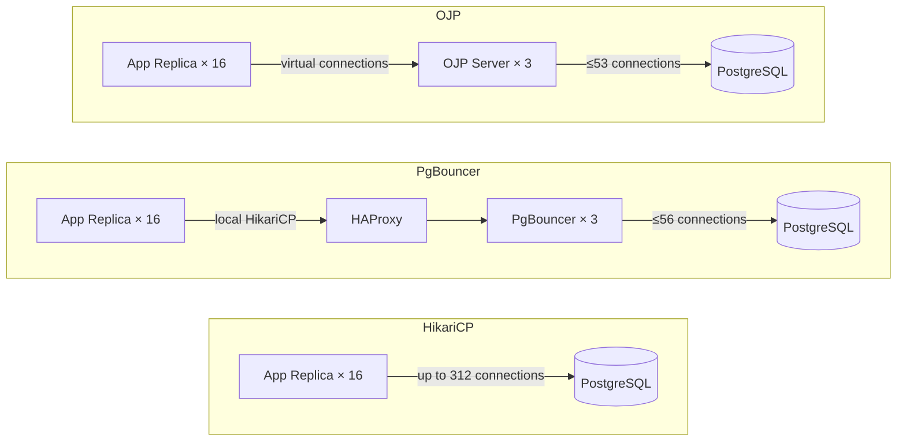
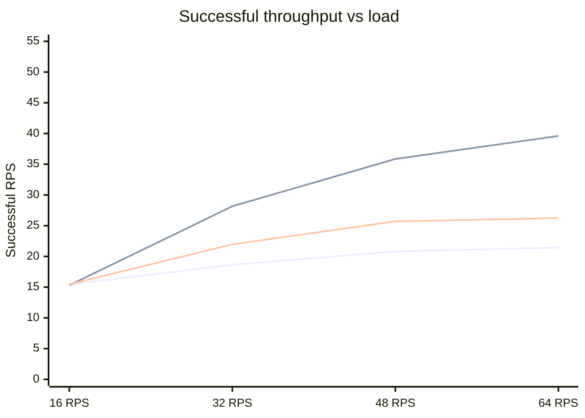
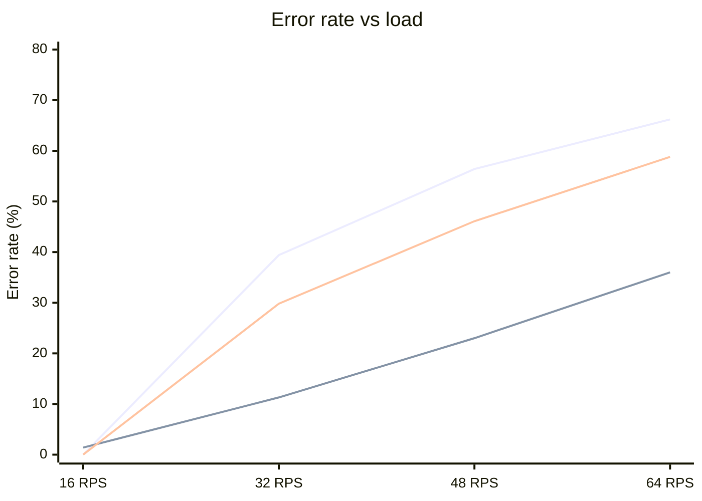
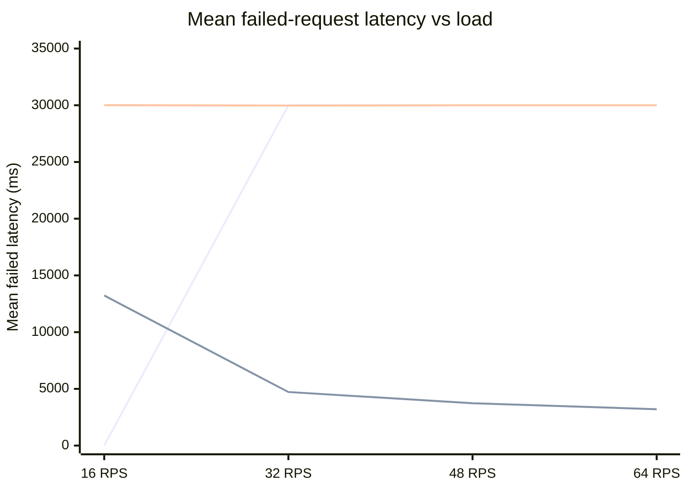
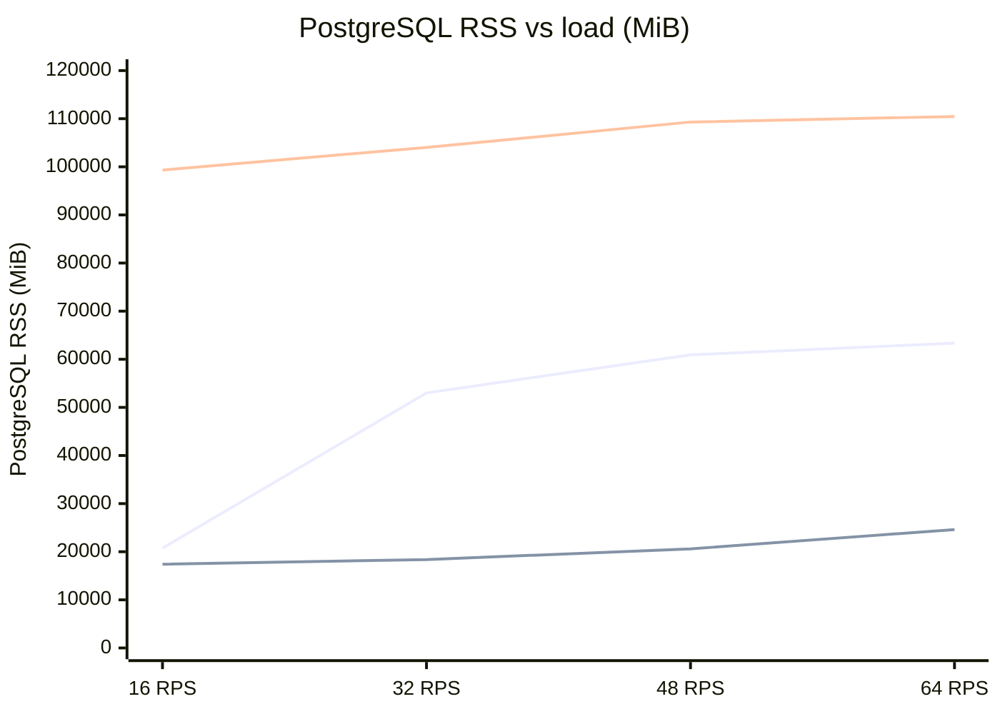
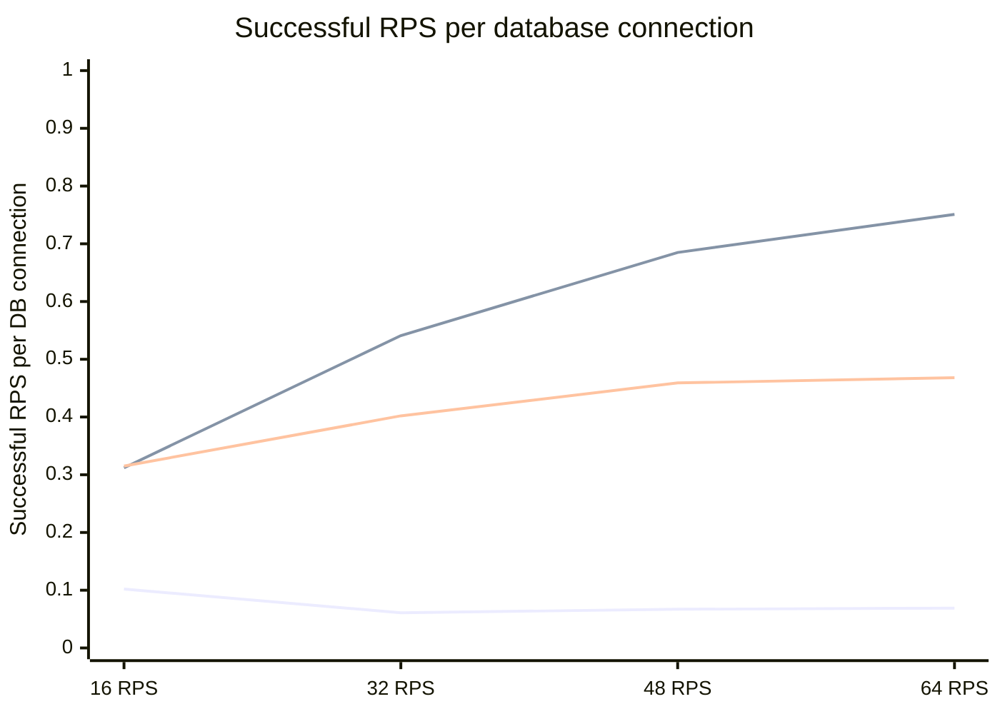

# Under Pressure: How OJP, PgBouncer, and HikariCP Handle a Real PostgreSQL Workload

When most people think about PostgreSQL performance tuning, they focus on indexes, query plans, and configuration knobs. But there is a layer that sits between your application and the database that has an outsized effect on how the whole system behaves under load: the connection strategy. This article documents a rigorous comparison of three widely-used approaches — **HikariCP with direct connections**, **PgBouncer with HAProxy**, and **OJP** (a centralized Java-based connection proxy) — under a demanding hybrid transactional/analytical workload pushed progressively to its limits.

## What Was Tested and Why It Matters

The W5_HTAP workload used here combines both fast transactional queries and slower analytical ones, a pattern increasingly common in modern applications that read reporting data while also processing live transactions. This mix is intentionally hard on connection pools: analytical queries hold connections much longer, which means the pool drains quickly when load increases.

The benchmark ran on identical hardware for all three technologies, with sixteen independent client processes simulating sixteen microservice replicas — a deliberately realistic topology. Using a single client would hide the fragmentation problems that arise in a real deployment where dozens of services each maintain their own pool. Load was swept across four levels — 16, 32, 48, and 64 aggregate requests per second — and each level was repeated five times so that the charts show means across those repetitions, with shaded bands indicating the min/max spread.

The three topologies under test represent meaningfully different architectural choices:



HikariCP is the direct baseline: each of the sixteen replicas holds its own local connection pool, so as more replicas come online or as more load is applied, the total number of open PostgreSQL connections grows accordingly — reaching 312 at the higher load levels. PgBouncer interposes a pooler layer fronted by HAProxy, capping the real backend connections at around 56. OJP takes a different approach: client-side pooling is removed entirely from the application, and virtual JDBC connections are multiplexed through a three-node OJP server tier that again limits real database connections to around 53.

## The Big Picture: Who Gets Work Done?

The most direct question in a benchmark like this is how much useful work each technology delivers. At light load — 16 aggregate requests per second — all three perform almost identically, completing about 15.3–15.5 successful requests per second. That is expected: at low load, there is no contention and every approach works fine.

Things diverge sharply as soon as load increases beyond what the database can comfortably absorb.



*Lines represent HikariCP (first), OJP (second), and PgBouncer (third).*

At 64 RPS, OJP is delivering **39.6 successful requests per second** while HikariCP manages only 21.4 and PgBouncer 26.2. That is nearly double the useful output compared to HikariCP and about 51% more than PgBouncer — despite all three being given the same offered load. The gap is not caused by OJP doing less work per connection; it is caused by the other two approaches wasting a large fraction of their connections on requests that will ultimately time out.

## Errors Tell the Real Story

Throughput numbers alone do not fully explain what is happening. The error rate chart makes it concrete.



*Lines represent HikariCP (first), OJP (second), and PgBouncer (third).*

HikariCP begins failing at 39% of requests the moment load doubles to 32 RPS, climbing to 66% at 64 RPS. PgBouncer is not much better at 59%. OJP errors grow more slowly — 11% at 32 RPS, settling at 36% at 64 RPS. That alone is a significant advantage, but the deeper story is in what happens when those errors occur.

## Why Fast Failures Are as Important as Low Failure Rates

There is a subtle but critical distinction between a system that fails 66% of requests and a system that also takes 30 seconds to tell you each of those requests has failed. With HikariCP and PgBouncer, failed requests hit the connection timeout ceiling — they sit in the queue for almost exactly 30,000 milliseconds before being rejected. From a user experience perspective, that is catastrophic: clients wait nearly a minute just to receive an error message.

OJP behaves fundamentally differently.



*Lines represent HikariCP (first), OJP (second), and PgBouncer (third). HikariCP has no data at 16 RPS because it produced no errors at that load level.*

At 64 RPS, OJP reports its failed requests in roughly **3.2 seconds** on average. At lighter load of 16 RPS it takes about 13 seconds, and crucially the latency *decreases* as load goes up — a sign that OJP's queue-rejection mechanism kicks in sooner the more congested the system becomes. For HikariCP and PgBouncer the error latency is flat at the timeout ceiling regardless of load level. A user waiting for a response under OJP knows within a few seconds that the request did not go through; under the other two, they wait half a minute for the same news.

## PostgreSQL Memory: The Quiet Advantage

One of the most striking findings in the resource data is how differently each approach affects PostgreSQL's memory footprint.



*Lines represent HikariCP (first), OJP (second), and PgBouncer (third).*

PostgreSQL's Resident Set Size — the memory it is actually using from the operating system's perspective — tells a clear story. Under OJP, PostgreSQL stays between **17 and 25 GiB** across all load levels. Under HikariCP it balloons from about 20 GiB at light load to over 63 GiB at full load. PgBouncer starts high — already at 99 GiB at the lowest load level — and climbs to 110 GiB.

The reason is directly visible in the connection count chart. HikariCP eventually opens 312 backend connections to PostgreSQL; each connection carries process memory, shared memory state, and working buffers. OJP and PgBouncer both constrain backend connections to roughly 50–56, but PgBouncer's memory baseline is dramatically higher than OJP's. This difference likely reflects how PgBouncer interacts with PostgreSQL's shared buffer and per-process memory allocations at session startup and the way those initial allocations are retained even in pooling mode.

## How Backend Connections Are Used

With OJP and PgBouncer both maintaining a similar number of real PostgreSQL connections, it is worth asking whether OJP uses those connections more efficiently.



*Lines represent HikariCP (first), OJP (second), and PgBouncer (third).*

At 64 RPS, OJP squeezes **0.75 successful requests per second out of each backend connection**, compared to 0.47 for PgBouncer and a mere 0.07 for HikariCP. The HikariCP number is so low because it has saturated its connection budget with 312 open connections while delivering relatively little successful work — most of those connections are either idle, blocked, or waiting for results that will timeout. OJP's higher efficiency per connection is what allows it to deliver more total successful work from the same number of real database sessions.

## The Latency of What Succeeds

The flip side of OJP's aggressive backpressure behaviour is that the requests which do succeed are served extremely quickly. The p95 latency chart for successful requests is perhaps the most dramatic chart in the entire benchmark.

At 32 RPS, OJP's p95 successful latency is **49 milliseconds**. HikariCP's is 121,966 milliseconds — nearly two minutes — and PgBouncer's is 45,210 milliseconds. The gap narrows at higher loads (OJP reaches 230 ms at 64 RPS) but OJP's successful p95 remains orders of magnitude better than both alternatives. What is happening is that OJP rejects requests it cannot serve quickly, rather than queuing them for long periods. Requests that get through the queue are processed without the long waits caused by a saturated connection pool. HikariCP queues everything; some succeed eventually, but the tail latency for those successes is astronomical because they have been waiting behind a long queue of other requests that are also competing for exhausted connections.

## OJP's Own Resource Cost

It would be incomplete to describe OJP's advantages without acknowledging its costs. OJP runs a three-node proxy tier on the JVM, and that tier consumes memory and CPU that the other approaches do not.

The OJP proxy tier uses around **1,023 to 1,079 MiB** of RSS across its three nodes combined across the load range. PgBouncer's equivalent proxy tier — three PgBouncer nodes plus HAProxy — uses only about **56 MiB** total. So OJP's proxy tier is roughly 18 times heavier in memory than PgBouncer's.

That said, the JVM overhead is relatively stable and predictable. The OJP heap-used figure stays between **88 and 90 MiB** cluster-wide regardless of load level, meaning the JVM is not under memory pressure even at peak load. The committed heap — memory the JVM has reserved but not necessarily filled with live objects — sits around 150–161 MiB, which is the JVM pre-allocating space it may need. The proxy tier memory is an upfront cost, not a cost that scales dangerously with load.

PostgreSQL CPU under OJP is also higher than under HikariCP in absolute terms: around 483% of a single virtual core at 64 RPS compared to 262% for HikariCP. That sounds concerning, but remember that OJP is simultaneously delivering 85% more successful work. When measured as CPU per successful request, the comparison looks much more favourable to OJP. PgBouncer's PostgreSQL CPU consumption is the highest of all — 933% at 64 RPS — which adds another data point suggesting that PgBouncer's interaction with PostgreSQL is less efficient than OJP's despite using a comparable connection count.

## Summary of the Key Findings

To make the relationships easier to compare at a glance, here is what the numbers say at the heaviest tested load of 64 aggregate requests per second:

```mermaid
block-beta
    columns 4
    H["HikariCP"] O["OJP"] P["PgBouncer"] L[""]
    h1["✅ 21.4 RPS delivered"] o1["🏆 39.6 RPS delivered"] p1["⚠️ 26.2 RPS delivered"] l1["Successful throughput"]
    h2["❌ 66% error rate"] o2["🏆 36% error rate"] p2["❌ 59% error rate"] l2["Error rate"]
    h3["❌ 30s to report failures"] o3["🏆 3.2s to report failures"] p3["❌ 30s to report failures"] l3["Failed request latency"]
    h4["⚠️ 63 GiB PostgreSQL RSS"] o4["🏆 24 GiB PostgreSQL RSS"] p4["❌ 108 GiB PostgreSQL RSS"] l4["PostgreSQL memory"]
    h5["❌ 312 DB connections"] o5["✅ 53 DB connections"] p5["✅ 56 DB connections"] l5["Backend connections"]
```

The headline takeaway is that under pressure, OJP delivers roughly double the successful work of HikariCP, about 51% more than PgBouncer, keeps error rates meaningfully lower, fails fast when it does reject, uses dramatically less PostgreSQL memory, and squeezes far more work per connection. The tradeoff is a heavier proxy tier that adds approximately one GiB of RSS and some additional CPU on the OJP nodes themselves.

## Methodology Notes

Each data point in the charts is the **mean across five repeated runs** at that load level. The shaded bands in the original figures show the min/max spread across those five repetitions; narrower bands indicate more consistent behaviour from run to run. All latency figures come from HDR histogram logs merged across replicas, not from per-replica JSON summaries, which gives a precise view of the actual tail latency distribution. The benchmark used an **open-loop load generator**, meaning new requests are dispatched on a fixed schedule independent of whether previous ones have completed — this is a deliberate choice that prevents the load generator from automatically slowing down when the system is overloaded, which would mask exactly the failure modes this benchmark is designed to surface.

The full results, raw data, and reproducible analysis scripts are available in this repository.
