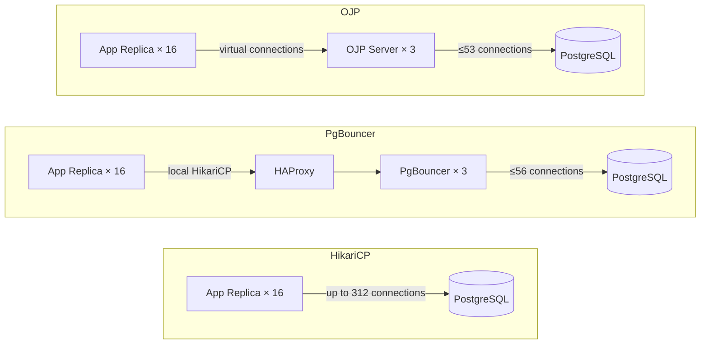
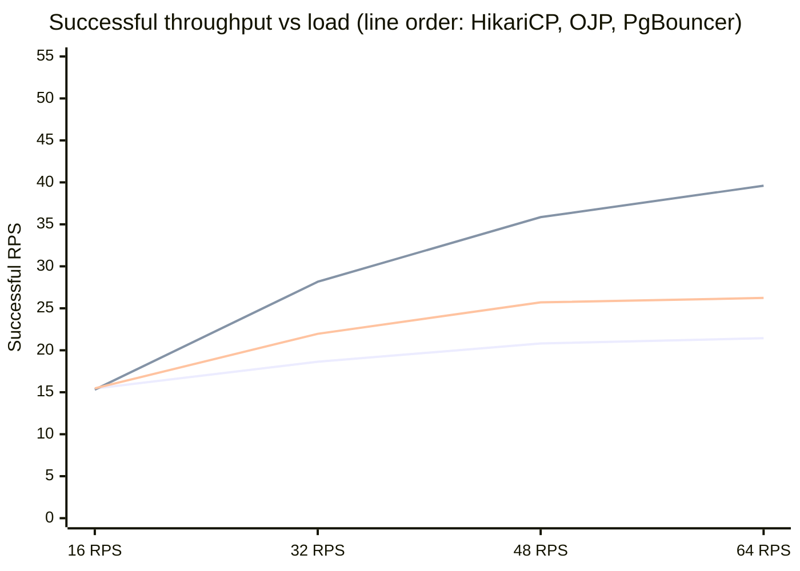
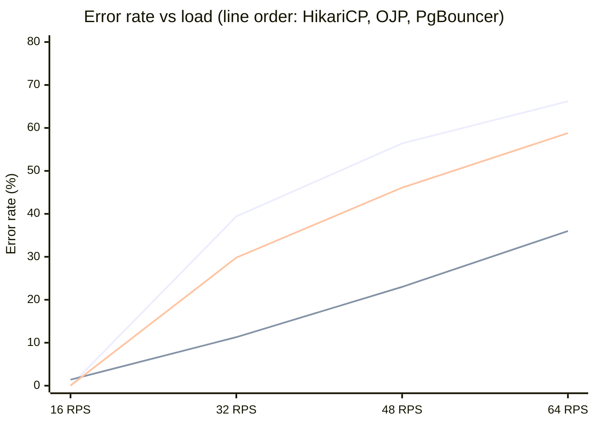
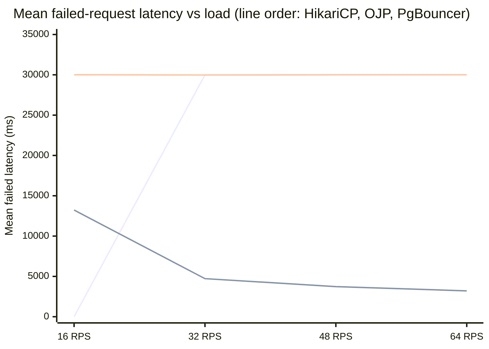
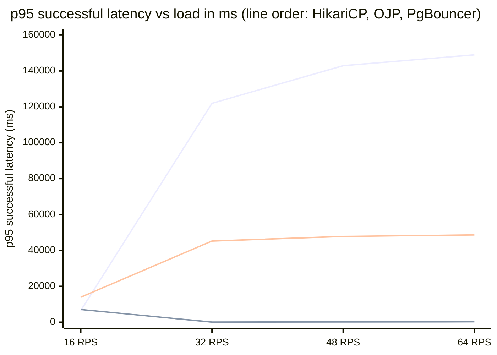
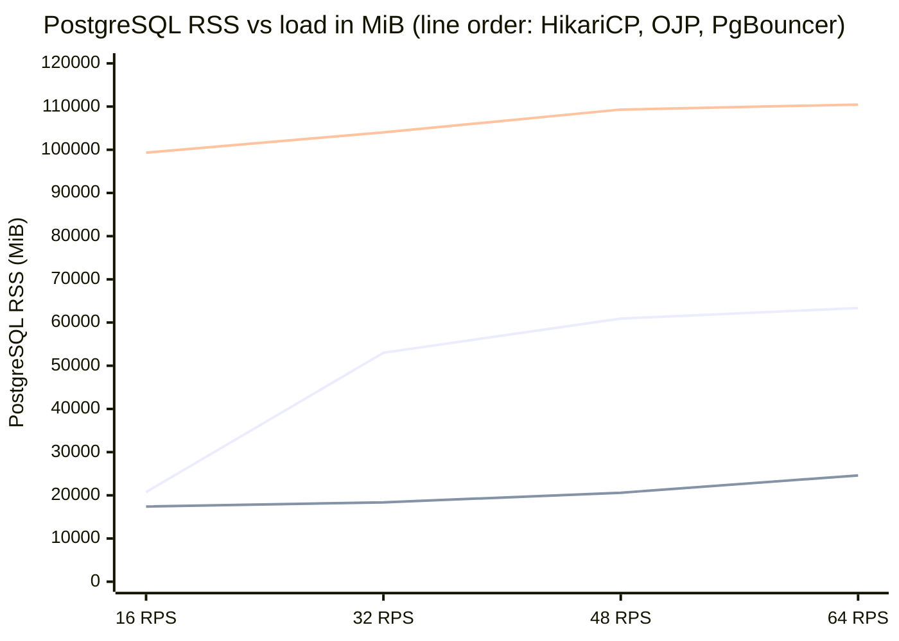
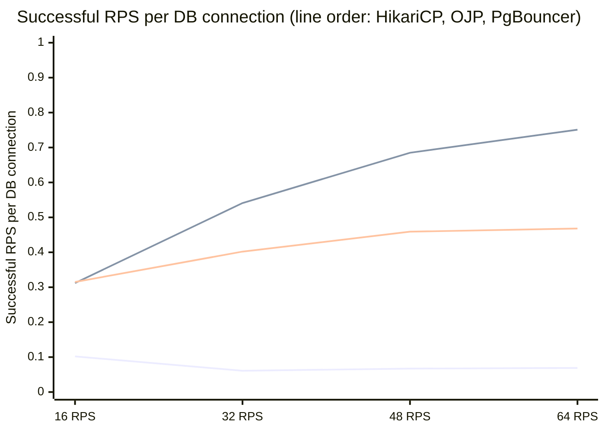

# Connection Management Under Pressure: An HTAP Benchmark of OJP, PgBouncer, and HikariCP

When most people think about PostgreSQL performance, they focus on indexes, query plans, and configuration knobs. But there is a layer between your application and the database that has an outsized effect on how the whole system behaves under load: the connection strategy. This article documents a controlled comparison of three widely-used approaches — **HikariCP with direct connections**, **PgBouncer with HAProxy**, and **OJP** (a centralized Java-based connection proxy) — under a mixed transactional/analytical workload pushed progressively to its limits.

## Results at a Glance

At the highest tested load (64 aggregate requests per second offered), the three technologies produced the following measured outcomes. The PostgreSQL RSS figure for PgBouncer is noted separately because it is an unexpected result that warrants further investigation; see the Limitations section.

| Metric at 64 offered RPS | HikariCP | OJP | PgBouncer |
|---|---|---|---|
| Successful throughput | 21.4 RPS | 39.6 RPS | 26.2 RPS |
| Error rate | 66.2% | 36.0% | 58.8% |
| Mean failed-request latency | ~30.0 s | ~3.2 s | ~30.0 s |
| Backend connections to PostgreSQL | 312 | 53 | 56 |
| Reported PostgreSQL RSS† | 63 GiB | 24 GiB | 108–110 GiB |

*† PostgreSQL RSS under PgBouncer is substantially higher than expected given the backend connection count. The cause is under investigation; see [Limitations and Open Questions](#limitations-and-open-questions).*

## What Was Tested and Why It Matters

The W5_HTAP workload combines fast transactional queries with slower analytical ones, a pattern common in applications that process live transactions while also reading reporting data. This mix is intentionally demanding for connection pools: analytical queries hold connections longer, which means the pool exhausts more quickly as load rises.

Sixteen independent client JVM processes simulated sixteen microservice replicas spread across two load-generator machines. Using a single client would hide the connection-fragmentation effects that occur in a real deployment where many services each maintain their own pool. Load was swept across four levels — 16, 32, 48, and 64 aggregate requests per second — and each level was repeated five times. Charts show the mean across those five repetitions; the original figures in the repository include min/max bands across repetitions.

Latency is measured end to end from when the open-loop load generator schedules each request until it completes or fails. The 30-second timeout applies to a connection acquisition attempt, not necessarily to the entire request lifecycle: under HikariCP and PgBouncer, a request can queue for a worker thread, then wait again for a connection from the pool, which is why successful p95 latency values can substantially exceed the connection timeout. This is discussed further in [The Latency of What Succeeds](#the-latency-of-what-succeeds).

## Architectures and Configurations

The three topologies model different production deployment patterns rather than being normalized to an identical connection count. The configurations were chosen to reflect their intended deployment defaults.

| | HikariCP | OJP | PgBouncer |
|---|---|---|---|
| Client pool per replica | 300 direct connections | None (virtual connections) | 48 HikariCP + PgBouncer pool size 16 per node |
| Backend DB connection budget | Up to 312 observed | 48 configured (≤53 observed) | ≤56 observed |
| Proxy tier | None | 3 OJP nodes | 3 PgBouncer nodes + 1 HAProxy node |

HikariCP is the direct baseline: each of the sixteen replicas holds its own local connection pool, so the total number of open PostgreSQL connections grows with the replica count — reaching 312 at higher load levels. PgBouncer interposes a pooler layer fronted by HAProxy, capping backend connections to around 56. OJP removes client-side pooling from the application entirely; virtual JDBC connections are multiplexed through a three-node OJP server tier, again limiting real database connections to around 53.

Because HikariCP was configured with a substantially larger backend connection budget, comparisons of connection-sensitive metrics like PostgreSQL RSS should account for that difference. The [Limitations and Open Questions](#limitations-and-open-questions) section discusses this further.

## Test Environment

The database and load-generation infrastructure were held constant across all three scenarios. Each proxy architecture used the topology described above. All machines ran Ubuntu 24.04 LTS on AMD EPYC processors, isolated on a dedicated private network with no TLS on any benchmark leg. The database node had 16 vCPUs and 295 GiB of RAM. Each of the two load generator machines had 16 vCPUs and 31 GiB of RAM, running eight bench replicas each. The three proxy or OJP nodes each had 8 vCPUs and 15 GiB of RAM; the HAProxy node used by the PgBouncer scenario had 4 vCPUs and 7.8 GiB. The database was pre-loaded with one million accounts, one hundred thousand items, and ten million orders. The full suite — four load levels, five repetitions per level, across all three technologies — ran across July 14–15, 2026 and took just over 33 hours in total.

## Successful Throughput

The most direct question in a benchmark like this is how much useful work each technology delivers.

| Offered load | HikariCP | OJP | PgBouncer |
|---|---|---|---|
| 16 RPS | 15.44 | 15.31 | 15.46 |
| 32 RPS | 18.63 | 28.16 | 21.96 |
| 48 RPS | 20.81 | 35.86 | 25.71 |
| 64 RPS | 21.44 | 39.60 | 26.23 |

At 16 aggregate requests per second, all three deliver around 15.3–15.5 successful requests per second. At low load there is little contention and any connection strategy works adequately. At 64 RPS, OJP delivers **39.6 successful requests per second** while HikariCP produces 21.4 and PgBouncer 26.2. The results indicate that the HikariCP and PgBouncer configurations converted a smaller proportion of offered load into successful requests at higher load levels. Determining exactly where time was spent would require connection-state, wait-event, and query-level analysis beyond the scope of this benchmark.

## Errors

Throughput figures alone do not fully capture the difference in behaviour. The error rate shows what fraction of offered requests were not completed successfully.

One notable result at the lowest load level is that OJP recorded a 1.4% error rate while HikariCP and PgBouncer were effectively error-free. Those OJP errors were `SQLTransientConnectionException` rejections — OJP's internal queue-limit firing when a virtual connection could not acquire an operation slot within the configured timeout. They appeared across all five repetitions at this load level, which suggests they reflect a consistent characteristic of the OJP queue configuration rather than an anomalous run. HikariCP and PgBouncer did not encounter this kind of fast rejection at low load because they accepted all requests into their queues and served them within the timeout window.

At higher loads, HikariCP errors reach 39% at 32 RPS and 66% at 64 RPS. PgBouncer reaches 59%. OJP errors grow more slowly, reaching 36% at the highest tested load level.

## Why Fast Failures Matter

There is a meaningful difference between a system that fails a request and one that takes 30 seconds to report that failure. With HikariCP and PgBouncer, failed requests exhaust the connection acquisition timeout — they wait for almost exactly 30,000 milliseconds before being rejected. That is operationally damaging: clients wait roughly 30 seconds just to receive an error, which ties up application threads and degrades the experience for downstream callers.

OJP behaves differently.

*HikariCP has no data at 16 RPS because it produced no errors at that load level.*

At 64 RPS, OJP's mean failed-request latency is roughly **3.2 seconds**. At 16 RPS it averages about 13 seconds — those are the same queue-limit rejections described above — and the latency decreases as load rises, indicating that OJP's backpressure mechanism rejects congested requests more quickly when the system is under greater pressure. For HikariCP and PgBouncer the failure latency stays flat at the timeout ceiling regardless of load.

## The Latency of What Succeeds

The flip side of OJP's backpressure behaviour is that requests which do succeed are served with considerably lower tail latency. The p95 successful latency shows this most clearly.

| Offered load | HikariCP p95 | OJP p95 | PgBouncer p95 |
|---|---|---|---|
| 16 RPS | 6,472 ms | 7,052 ms | 13,931 ms |
| 32 RPS | 121,966 ms | 49 ms | 45,210 ms |
| 48 RPS | 142,947 ms | 147 ms | 47,779 ms |
| 64 RPS | 148,990 ms | 230 ms | 48,644 ms |

At 32 RPS, OJP's p95 successful latency is **49 milliseconds**. HikariCP's is 121,966 milliseconds and PgBouncer's is 45,210 milliseconds. The HikariCP figure is not erroneous: because latency is measured end to end from when the load generator schedules each request, a request that queues for a worker thread, then waits for a pool connection, can accumulate substantially more than one connection-timeout period before completing. OJP avoids this by rejecting requests it cannot serve quickly, so requests that make it through are not delayed by a long queue ahead of them. The gap narrows at higher loads but OJP's successful p95 remains substantially lower across all tested load points.

## PostgreSQL Memory

One of the more striking results in the resource data concerns PostgreSQL's memory footprint.

Under OJP, PostgreSQL RSS stays between **17 and 25 GiB** across all load levels. Under HikariCP it grows from about 20 GiB at low load to over 63 GiB at full load, tracking the backend connection count: HikariCP eventually opens 312 connections, and each carries process memory and working buffers. OJP holds backend connections to around 53 and PostgreSQL memory grows accordingly.

The PgBouncer result is harder to explain. PgBouncer also constrains backend connections to around 56, similar to OJP, yet PostgreSQL RSS starts at approximately 99 GiB at the lowest load level and climbs to 110 GiB — substantially more than even HikariCP at peak. These measurements do not establish a cause. The result may reflect workload behaviour, PostgreSQL memory accounting, retained allocations, the way RSS was aggregated across PostgreSQL processes (which can cause shared memory pages to be counted more than once), or something specific to the PgBouncer session model. Further investigation using proportional set size, cgroup memory, and PostgreSQL memory instrumentation is needed before attributing a cause.

## How Backend Connections Are Used

With OJP and PgBouncer both maintaining a similar number of real PostgreSQL connections, it is worth examining how much successful work each backend connection produces.

At 64 RPS, OJP delivers **0.75 successful requests per second per backend connection**, compared to 0.47 for PgBouncer and 0.07 for HikariCP. OJP's higher throughput per connection is consistent with its lower error rate and faster failure reporting: fewer backend connections are occupied serving requests that will ultimately be rejected, so a greater proportion of connection time goes toward requests that succeed.

## OJP's Own Resource Cost

OJP runs a three-node JVM proxy tier that carries resource costs not present in the other two topologies.

The OJP proxy tier uses around **1,023 to 1,079 MiB** of RSS across its three nodes combined. PgBouncer's equivalent tier — three PgBouncer nodes plus HAProxy — uses about **56 MiB** total, making the OJP proxy tier roughly 18 times heavier in memory. That difference is a real cost that should be factored into any deployment decision.

What is notable is that the OJP JVM overhead is stable across load levels. Heap used stays between **88 and 90 MiB** cluster-wide regardless of load, indicating the JVM is not under memory pressure at peak. The committed heap — memory the JVM has reserved for reuse — sits around 150–161 MiB. The proxy tier memory is an upfront cost that does not scale meaningfully with offered load.

PostgreSQL CPU under OJP is higher than under HikariCP in absolute terms: around 483% of a single virtual core at 64 RPS compared to 262% for HikariCP. OJP is simultaneously delivering 85% more successful work at that load level, so CPU per successful request is more favourable than the raw figure suggests. PgBouncer's PostgreSQL CPU is the highest of all three — 933% at 64 RPS — while also delivering lower successful throughput than OJP, which makes it the most CPU-intensive option per unit of useful work completed.

## System-Wide Resource Totals

Viewing the proxy tier in isolation understates OJP's advantage. The table below sums PostgreSQL RSS and proxy-tier RSS to give the full database-plus-proxy infrastructure footprint at each load level.

| Offered load | HikariCP total RSS | OJP total RSS | PgBouncer total RSS |
|---|---|---|---|
| 16 RPS | 20.3 GiB | 18.0 GiB | 97.1 GiB |
| 32 RPS | 51.8 GiB | 19.0 GiB | 101.6 GiB |
| 48 RPS | 59.5 GiB | 21.2 GiB | 106.8 GiB |
| 64 RPS | 61.9 GiB | 25.1 GiB | 107.9 GiB |

*(HikariCP has no proxy tier; its total equals its PostgreSQL RSS.)*

At peak load, OJP's combined footprint of **25 GiB** is 2.5 times lower than HikariCP's 62 GiB and 4.3 times lower than PgBouncer's 108 GiB. The 1 GiB OJP proxy tier adds only a small amount to the total; the difference is driven almost entirely by how each architecture affects the PostgreSQL process footprint.

The CPU picture is different. OJP's total CPU (PostgreSQL plus proxy) at 64 RPS is about 494%, compared to 262% for HikariCP and 934% for PgBouncer. In absolute terms OJP consumes roughly 1.9× more CPU than HikariCP. Normalising by successful throughput, however, the gap largely closes: at 64 RPS OJP uses approximately **12.5% of a virtual core per successful request**, compared to 12.2% for HikariCP and 35.6% for PgBouncer. OJP's higher absolute CPU consumption is proportional to the additional work it completes.

| Offered load | HikariCP CPU/succ. RPS | OJP CPU/succ. RPS | PgBouncer CPU/succ. RPS |
|---|---|---|---|
| 16 RPS | 8.4% | 18.6% | 26.5% |
| 32 RPS | 10.3% | 16.3% | 33.7% |
| 48 RPS | 11.2% | 14.9% | 36.1% |
| 64 RPS | 12.2% | 12.5% | 35.6% |

*(Total CPU = PostgreSQL + proxy tier. HikariCP has no proxy tier.)*

At low load the per-request CPU cost for OJP is higher than HikariCP's — the proxy tier JVM and OJP's internal routing carry a fixed overhead that matters more when requests are infrequent. As load rises and OJP routes more successful work, the two converge. At 64 RPS the difference is negligible: OJP achieves nearly identical CPU efficiency to HikariCP per successful request, at 2.5 times lower total memory cost.

## Summary

| Metric at 64 offered RPS | HikariCP | OJP | PgBouncer |
|---|---|---|---|
| Successful throughput | 21.4 RPS | 39.6 RPS | 26.2 RPS |
| Error rate | 66.2% | 36.0% | 58.8% |
| Mean failed-request latency | ~30.0 s | ~3.2 s | ~30.0 s |
| p95 successful latency | ~149,000 ms | ~230 ms | ~48,644 ms |
| Backend connections to PostgreSQL | 312 | 53 | 56 |
| Reported PostgreSQL RSS† | 63 GiB | 24 GiB | 108–110 GiB |
| Successful RPS per DB connection | 0.07 | 0.75 | 0.47 |
| Proxy-tier RSS | — | ~1,050 MiB | ~56 MiB |

*† See Limitations.*

In this benchmark configuration, centralized capacity control produced a materially different overload response from independently managed application pools. At the highest tested load, OJP delivered 39.6 successful requests per second, compared with 26.2 for PgBouncer and 21.4 for HikariCP, while reporting rejected requests substantially faster. It achieved this with approximately 53 PostgreSQL connections, at the cost of roughly 1 GiB of additional proxy-tier RSS.

## Limitations and Open Questions

These results apply to the tested workload, hardware, configurations, and load range. Several caveats are worth stating explicitly.

The configurations were not designed to provide each technology with an identical backend connection count. They modelled intended production deployment patterns: independently sized local pools for HikariCP, and centrally bounded backend capacity for OJP and PgBouncer. The difference in database pressure — 312 connections for HikariCP versus roughly 53–56 for the others — is part of what each architecture produces, not an independently controlled variable. Additional experiments with equalized connection budgets would help separate architectural effects from configuration effects.

The unexpectedly high PostgreSQL RSS measured during PgBouncer runs (99–110 GiB despite roughly 56 backend connections) is the most significant unexplained finding. The current data does not establish a cause, and this result should not be cited without the caveat that the measurement itself requires validation with proportional set size and cgroup memory tools.

Only four discrete load levels were measured. The article describes how metrics change across those points but cannot characterize behaviour between them or beyond them.

Five repetitions per load level provide a useful indication of reproducibility, but they are not sufficient for formal statistical testing. The full per-repetition values are available in `output/comparison-2026-07-16-065301-125192/report/repetition_values.csv` for downstream analysis.

## Methodology Notes

Each data point is the mean across five repeated runs at the same load level. The benchmark used an **open-loop load generator**, dispatching new requests on a fixed schedule independent of whether previous ones have completed. This is a deliberate choice: a closed-loop generator would automatically slow down when the system was overloaded, masking the failure modes this benchmark was designed to measure.

The full results, raw data, and reproducible analysis scripts are available in this repository.
