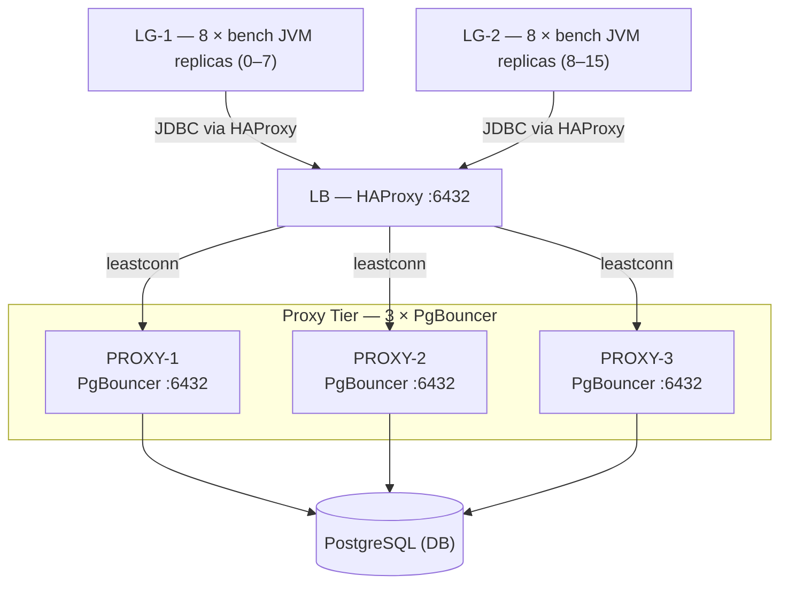
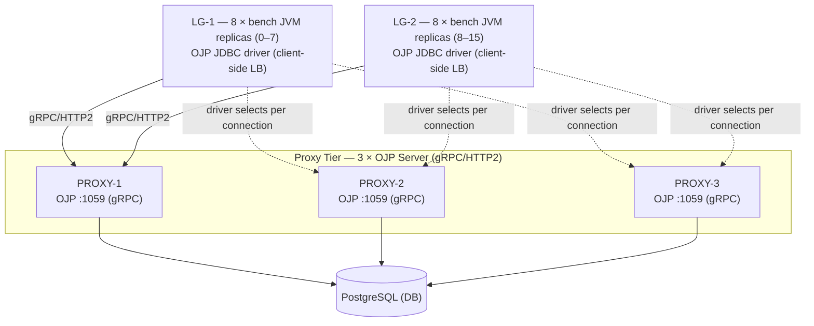
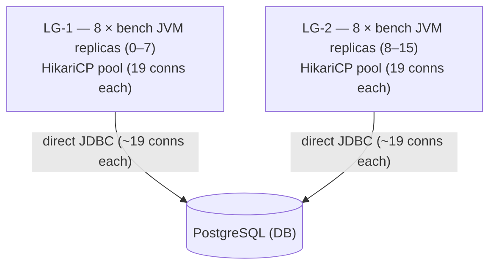

# Reference Benchmarking Guide for JDBC Workloads

## Purpose

This document provides a complete, step-by-step protocol for running reproducible JDBC workload
stress tests with Stressar. It specifies deployment topology, hardware requirements, software
configuration, workload definitions, load levels, acceptance criteria, and analysis procedures for
the bundled PostgreSQL reference scenarios. The same workflow can be adapted to other
JDBC-capable databases and middleware topologies.

All instructions are prescriptive. Deviations from the specified configuration must be documented
in the experimental report along with a justification.

> **Why were these specific values chosen?** The reasoning behind every numeric constant in this
> guide — 16 client processes, 300 direct connections / 48 proxy backend connections, 63 RPS per
> replica, 300 s warmup, 10 s SLO, and all others — is documented in
> **[PARAMETER_DECISIONS.md](PARAMETER_DECISIONS.md)**.

**Core design constraints (non-negotiable):**

1. **No TLS on any network leg.** All benchmark traffic runs as plaintext inside a trusted,
   isolated network (dedicated benchmark VLAN or cloud VPC with no public routing). This is a
   deliberate choice: many internal service-to-service architectures operate without TLS on
   low-latency, trusted paths (e.g., within a single availability zone). Excluding TLS removes
   handshake overhead and cipher-suite CPU cost as confounding variables, keeping the comparison
   focused purely on connection-pooling and proxy overhead. Any difference in results observed
   when TLS is added is a separate measurement concern and is outside the scope of this study.

2. **All scenarios use multiple client JVM processes.** A single-process benchmark does not model
   the connection-fragmentation pattern of a real microservice deployment. Every scenario runs
   **16 independent `bench` JVM processes** (8 on each of two identical load-generator machines,
   LG-1 and LG-2), each
   representing one microservice replica.

---

## Benchmark Philosophy: Production Topology, Not Equal Knobs

This reference benchmark compares realistic production JDBC topologies rather than artificially
identical network paths or identical client-side settings.

- **HikariCP direct baseline (`hikari-prod`)** models a common elastic microservice architecture:
  each replica owns a local JDBC pool, so total possible PostgreSQL connections grow as replicas
  scale.
- **OJP (`ojp-prod`)** models centralized JDBC connection management: clients expose logical JDBC
  connections, while real PostgreSQL connections are pooled in the OJP server tier. No local
  client-side HikariCP pool is used.
- **PgBouncer (`pgbouncer-prod`)** models a common Java deployment: applications keep local HikariCP
  pools, PgBouncer consolidates backend PostgreSQL connections, and HAProxy handles multi-node
  PgBouncer load balancing/HA.

These three scenarios are the current bundled reference topologies. Additional JDBC-capable
databases, drivers, and proxy layers can be added using the same workload and measurement model.

OJP is intentionally not placed behind HAProxy for topology symmetry. Client-side balancing and
failover are part of the OJP JDBC driver model.

All results must report both configured and observed backend PostgreSQL connections. Proxy-tier
resource usage is computed as a time-aligned sum across required components for each topology
(`max_t(sum cpu_pct)` for aligned peak; report also includes legacy non-time-aligned peak-sum):

- OJP proxy tier = OJP-1 + OJP-2 + OJP-3
- PgBouncer proxy tier = HAProxy + PgBouncer-1 + PgBouncer-2 + PgBouncer-3

---

## Table of Contents

1. [Test Environment Topology](#1-test-environment-topology)
2. [Hardware Specifications](#2-hardware-specifications)
3. [Software Installation](#3-software-installation)
4. [PostgreSQL Configuration](#4-postgresql-configuration)
5. [PgBouncer Configuration](#5-pgbouncer-configuration)
6. [OJP Configuration](#6-ojp-configuration)
7. [Database Initialisation](#7-database-initialisation)
8. [Environment Snapshot](#8-environment-snapshot)
9. [Little's Law: Capacity Analysis](#9-littles-law-capacity-analysis)
10. [Test Scenarios](#10-test-scenarios)
    - [SUT-A — Baseline: HikariCP Disciplined (16 clients)](#sut-a--baseline-hikaricp-disciplined-16-clients)
    - [SUT-B — OJP (3 nodes, 16 clients)](#sut-b--ojp-3-nodes-16-clients)
    - [SUT-C — PgBouncer (3 nodes + HAProxy, 16 clients)](#sut-c--pgbouncer-3-nodes--haproxy-16-clients)
    - [Test A — Capacity Sweep](#test-a--capacity-sweep-all-suts)
    - [Test B — Overload and Recovery](#test-b--overload-and-recovery-all-suts)
11. [Measurement Collection](#11-measurement-collection)
12. [Expected Outcomes and Acceptance Criteria](#12-expected-outcomes-and-acceptance-criteria)
13. [Analysis Procedure](#13-analysis-procedure)
14. [Known Limitations](#14-known-limitations)

---

## 1. Test Environment Topology

All three SUT scenarios share the same physical infrastructure. The **same two load-generator
machines** (LG-1 and LG-2) run 16 independent `bench` JVM processes (8 per machine) in every
scenario. Both machines are identical in role: they both run bench JVM processes issuing JDBC
requests. The split exists purely to avoid CPU contention — 8 processes fit comfortably on an
8-core machine. This is the key difference from a single-client design: 16 processes simulate
16 microservice replicas, each maintaining its own connection pool or OJP virtual connections.

**No TLS is used on any network leg** in any scenario. All traffic is plaintext inside an isolated
benchmark network. This keeps the comparison focused on connection-pooling and proxy overhead.

The topology differences between SUTs are on the **proxy tier**, not the client tier:

- **SUT-A (HikariCP Baseline)**: no proxy tier — each of the 16 client processes connects directly
  to PostgreSQL (plaintext). Total backend connections = 16 × 19 ≈ 300.
- **SUT-B (OJP)**: no external load balancer — the OJP JDBC driver performs client-side load
  balancing across three OJP servers using a multi-host URL. All traffic is plaintext.
- **SUT-C (PgBouncer)**: an HAProxy load balancer distributes connections from the 16 client
  processes across three PgBouncer instances. All traffic is plaintext.

### SUT-C — PgBouncer Topology (HAProxy Load Balancer)



### SUT-B — OJP Topology (Client-Side Load Balancing, gRPC/HTTP2)



> **Note on OJP port:** The OJP gRPC server listens on port **1059** by default (not 5432).
> The OJP JDBC URL uses the format `jdbc:ojp[host:1059,...]_postgresql://dbhost:5432/db`.
> See [install/OJP.md](install/OJP.md) for the exact driver URL syntax.

### SUT-A — Baseline Topology (HikariCP Disciplined, 16 clients, no proxy)



**Machine roles — all scenarios:**

| Label   | Role                                                                                    | Scenarios    |
| ------- | --------------------------------------------------------------------------------------- | ------------ |
| LG-1    | Load generator machine 1 — runs 8 bench JVM replicas (JVM 0–7); identical role to LG-2  | All          |
| LG-2    | Load generator machine 2 — runs 8 bench JVM replicas (JVM 8–15); identical role to LG-1 | All          |
| LB      | HAProxy load balancer — distributes connections to 3 × PgBouncer                        | SUT-C only   |
| PROXY-1 | Connection proxy (instance 1) — runs PgBouncer or OJP                                   | SUT-B, SUT-C |
| PROXY-2 | Connection proxy (instance 2) — runs PgBouncer or OJP                                   | SUT-B, SUT-C |
| PROXY-3 | Connection proxy (instance 3) — runs PgBouncer or OJP                                   | SUT-B, SUT-C |
| DB      | Database server — runs PostgreSQL                                                       | All          |

Each of the three proxy instances (SUT-B OJP, SUT-C PgBouncer) maintains an independent backend
connection pool of **16 connections** to PostgreSQL, giving a total of **48 backend connections**
across the proxy tier. This is a 6.25× reduction from the 300 backend connections held by the 16
direct clients in SUT-A (16 × ≈19 = 304 ≈ 300), and is the principal value the proxy provides:
many client-side connections share a smaller, more efficient set of server-side connections.

---

## 2. Hardware Specifications

The following specifications define the **minimum** hardware to be used for a study intended for
publication. Using lower specifications is acceptable only if every SUT runs on identical hardware.

**Ideal client configuration:** 16 bench JVM processes, 8 per machine (LG-1 and LG-2), each
representing one microservice replica. Both machines are identical in role — "LG-1" and "LG-2"
simply distinguish the two physical hosts. 8 processes fit on an 8-core machine without CPU
contention; splitting across two identical machines also ensures the client tier is not the
bottleneck. LG-1 and LG-2 are both required for **all scenarios** (SUT-A, SUT-B, SUT-C).

### 2.1 Load Generator (LG-1 and LG-2)

| Component | Specification                                                                      |
| --------- | ---------------------------------------------------------------------------------- |
| CPU       | 8 physical cores, ≥3.0 GHz base clock (e.g., Intel Xeon E-2288G or AMD EPYC 7302P) |
| RAM       | 32 GB ECC DDR4-2666                                                                |
| Network   | 10 GbE NIC (single port, direct-attached to switch)                                |
| Storage   | Any (not performance-critical for LG-1/LG-2)                                       |
| OS        | Ubuntu 22.04 LTS, kernel 5.15 or later                                             |
| JVM       | OpenJDK 21.0.x, G1GC, `-Xms4g -Xmx8g -XX:+UseG1GC`                                 |

Both LG-1 and LG-2 use this identical specification. LG-1 runs bench JVM replicas (JVM 0–7) and
LG-2 runs bench JVM replicas (JVM 8–15). Each replica uses approximately 500 MB heap,
so 8 replicas total ≈ 4 GB heap, well within the 8 GB `-Xmx` limit. CPU utilisation at
1,000 RPS aggregate (≈ 63 RPS per replica) is expected to be 1–2 cores per replica peak,
leaving headroom on an 8-core machine.

### 2.2 Proxy Tier (PROXY-1, PROXY-2, PROXY-3)

Three identical machines. The same machines are reused for both SUT-B (OJP) and SUT-C
(PgBouncer) — stop one service and start the other between scenario runs to control for
hardware variation.

| Component | Specification                          |
| --------- | -------------------------------------- |
| CPU       | 8 physical cores, ≥3.0 GHz base clock  |
| RAM       | 16 GB ECC DDR4-2666                    |
| Network   | 10 GbE NIC                             |
| Storage   | Any                                    |
| OS        | Ubuntu 22.04 LTS, kernel 5.15 or later |

PgBouncer is single-threaded; a single core at 3 GHz can sustain approximately 50,000 simple
transactions per second. The 8-core specification allows headroom for the OS and network interrupt
handling. OJP is multi-threaded (Netty event loops) and benefits from additional cores.

### 2.3 Load Balancer (LB) — SUT-C only

The load balancer is **only required for SUT-C (PgBouncer)**. OJP (SUT-B) performs
client-side load balancing via the OJP JDBC driver; no dedicated LB machine is needed for SUT-B.

| Component | Specification                          |
| --------- | -------------------------------------- |
| CPU       | 4 physical cores, ≥2.5 GHz base clock  |
| RAM       | 8 GB DDR4                              |
| Network   | 10 GbE NIC                             |
| Storage   | Any                                    |
| OS        | Ubuntu 22.04 LTS, kernel 5.15 or later |
| Software  | HAProxy 2.8 or later                   |

HAProxy in TCP mode adds less than 0.05 ms round-trip overhead on a 10 GbE LAN.

### 2.4 Database Server (DB)

| Component      | Specification                                                                   |
| -------------- | ------------------------------------------------------------------------------- |
| CPU            | 16 physical cores, ≥3.0 GHz base clock (e.g., AMD EPYC 7302P × 2)               |
| RAM            | 128 GB ECC DDR4-3200                                                            |
| Storage (data) | NVMe SSD, ≥1 TB, ≥500 K random IOPS (e.g., Samsung PM9A3, Intel P5800X)         |
| Storage (WAL)  | Separate NVMe SSD, ≥200 GB (prevents WAL writes from competing with data reads) |
| Network        | 10 GbE NIC                                                                      |
| OS             | Ubuntu 22.04 LTS, kernel 5.15 or later                                          |

**Rationale for 128 GB RAM:** The large dataset used in this benchmark (see Section 8) is
approximately 22 GB. Allocating 64 GB to `shared_buffers` ensures that steady-state queries
execute entirely from cache, isolating the connection-pooling layer from disk I/O variability.
Researchers who intentionally wish to measure I/O-bound behaviour should reduce `shared_buffers`
to 8 GB and document this deviation.

---

## 3. Software Installation

> **Detailed installation guides** for each component are available in
> [docs/install/](install/README.md). This section summarises the commands needed for the benchmark
> environment; consult the linked guides for troubleshooting and alternative installation methods.

### 3.1 Build the Benchmark Tool

> **Prerequisites:** [Java 11+](install/JAVA.md) must be installed. Gradle is downloaded
> automatically by the `./gradlew` wrapper — see [install/GRADLE.md](install/GRADLE.md).

On LG-1 and LG-2 (run the same commands on both machines):

```bash
git clone https://github.com/rrobetti/stressar.git
cd stressar
./gradlew installDist
export BENCH="$(pwd)/build/install/stressar/bin/bench"
```

Verify:

```bash
$BENCH --version
```

### 3.2 Install PostgreSQL 16 on DB

> Full installation and configuration instructions: [install/POSTGRESQL.md](install/POSTGRESQL.md)

```bash
sudo apt-get install -y postgresql-16 postgresql-16-contrib
```

Verify:

```bash
psql --version   # Must report 16.x
```

### 3.3 Install HAProxy on LB (T3 only)

> Full installation and configuration instructions: [install/HAPROXY.md](install/HAPROXY.md)

The load balancer is only needed for the T3 (PgBouncer) scenario. Skip this section for T4.

```bash
sudo apt-get install -y haproxy
haproxy -v   # Must report 2.8 or later
```

Configure `/etc/haproxy/haproxy.cfg`:

```
global
    maxconn 10000

defaults
    mode    tcp
    timeout connect 5s
    timeout client  300s
    timeout server  300s

frontend pgbouncer_front
    bind *:6432
    default_backend pgbouncer_back

backend pgbouncer_back
    balance leastconn
    server proxy1 <PROXY1_IP>:6432 check inter 2s
    server proxy2 <PROXY2_IP>:6432 check inter 2s
    server proxy3 <PROXY3_IP>:6432 check inter 2s
```

Reload HAProxy after configuration changes:

```bash
sudo systemctl reload haproxy
```

### 3.4 Install PgBouncer on PROXY-1, PROXY-2, PROXY-3

> Full installation and configuration instructions: [install/PGBOUNCER.md](install/PGBOUNCER.md)

> **Note:** pgBouncer is installed on the **same PROXY-1/2/3 machines** used for OJP (SUT-B). No
> additional nodes are required for SUT-C. Stop the OJP service before starting pgBouncer on those
> nodes — see [Switching between proxy services](#switching-between-proxy-services) for the
> step-by-step procedure.

```bash
sudo apt-get install -y pgbouncer
pgbouncer --version  # Must report 1.21 or later
```

### 3.5 Install OJP on PROXY-1, PROXY-2, PROXY-3

> Full installation and configuration instructions: [install/OJP.md](install/OJP.md)

Follow the OJP project installation instructions on each of PROXY-1, PROXY-2, and PROXY-3. OJP
must be reachable on port 5432 on each machine.

---

## 4. PostgreSQL Configuration

### 4.1 Create Benchmark User and Database

```bash
sudo -u postgres psql <<'EOF'
CREATE DATABASE benchdb;
CREATE USER benchuser WITH PASSWORD 'benchpass';
GRANT ALL PRIVILEGES ON DATABASE benchdb TO benchuser;
\c benchdb
GRANT ALL ON SCHEMA public TO benchuser;
EOF
```

### 4.2 postgresql.conf — Recommended Settings

Edit `/etc/postgresql/16/main/postgresql.conf`:

```ini
# Memory
shared_buffers            = 64GB
effective_cache_size      = 100GB
work_mem                  = 64MB
maintenance_work_mem      = 4GB

# WAL
wal_buffers               = 64MB
min_wal_size              = 4GB
max_wal_size              = 16GB
checkpoint_completion_target = 0.9

# Parallelism
max_worker_processes      = 16
max_parallel_workers      = 16
max_parallel_workers_per_gather = 4

# Connections
max_connections           = 400
# SUT-A (HikariCP direct) uses up to 300 backend connections (16 × 19 ≈ 304).
# Proxy SUTs (OJP, PgBouncer) use 48 backend connections (3 × 16).
# Reserve 10 for superuser maintenance; remaining headroom for monitoring agents.

# Statistics
shared_preload_libraries  = 'pg_stat_statements'
pg_stat_statements.track  = all
pg_stat_statements.max    = 10000
track_io_timing           = on
track_activity_query_size = 2048

# Storage
random_page_cost          = 1.1     # NVMe SSD
effective_io_concurrency  = 256
```

### 4.3 pg_hba.conf

Allow password authentication from all load-generator and proxy machines (plaintext connections
are used — `host`, not `hostssl`):

```
# TYPE  DATABASE  USER       ADDRESS          METHOD
host    benchdb   benchuser  <LG1_IP>/32      scram-sha-256
host    benchdb   benchuser  <LG2_IP>/32      scram-sha-256
host    benchdb   benchuser  <PROXY1_IP>/32   scram-sha-256
host    benchdb   benchuser  <PROXY2_IP>/32   scram-sha-256
host    benchdb   benchuser  <PROXY3_IP>/32   scram-sha-256
# Allow superuser access from localhost for maintenance
local   all       postgres                    peer
```

### 4.4 Restart and Verify

```bash
sudo systemctl restart postgresql
psql -U benchuser -d benchdb -c "CREATE EXTENSION IF NOT EXISTS pg_stat_statements;"
psql -U benchuser -d benchdb -c "SELECT version();"
```

---

## 5. PgBouncer Configuration

The following configuration is applied identically to PROXY-1, PROXY-2, and PROXY-3. Each
instance connects directly to the PostgreSQL server (plaintext) and maintains an independent
backend pool of **16 connections**. The aggregate backend-connection count across the three
instances is **48**, which is sized at one connection per DB CPU core per proxy node and
represents a 6.25× reduction from the 300 connections used by SUT-A.

### 5.1 /etc/pgbouncer/pgbouncer.ini (apply on each of PROXY-1, PROXY-2, PROXY-3)

```ini
[databases]
benchdb = host=<DB_IP> port=5432 dbname=benchdb

[pgbouncer]
listen_addr          = *
listen_port          = 6432
auth_type            = scram-sha-256
auth_file            = /etc/pgbouncer/userlist.txt
pool_mode            = transaction
max_client_conn      = 2000
default_pool_size    = 16
reserve_pool_size    = 4
reserve_pool_timeout = 5
server_idle_timeout  = 600
client_idle_timeout  = 0
log_connections      = 0
log_disconnections   = 0
log_pooler_errors    = 1
stats_period         = 60
ignore_startup_parameters = extra_float_digits
```

**Parameter rationale:**

- `pool_mode = transaction`: This is the only mode that achieves meaningful connection
  multiplexing. Session mode provides no multiplexing benefit over direct pooling; statement mode
  is incompatible with multi-statement transactions and explicit transaction boundaries.
- `default_pool_size = 16`: Each PgBouncer instance holds 16 backend connections — one per DB
  CPU core. With 3 instances behind the load balancer, the total backend connection count is 48.
  This demonstrates connection multiplexing: up to 2,000 client-side TCP connections per instance
  share just 16 server-side connections.
- `max_client_conn = 2000`: Allows up to 2000 concurrent client-side TCP connections per
  PgBouncer instance, which is more than sufficient for all test scenarios in this benchmark.
- `ignore_startup_parameters = extra_float_digits`: Required for the PostgreSQL JDBC driver ≥42.2,
  which sends `extra_float_digits=3` in the startup message; PgBouncer rejects unknown parameters
  by default.

### 5.2 userlist.txt (apply on each of PROXY-1, PROXY-2, PROXY-3)

```
"benchuser" "benchpass"
```

### 5.3 Start PgBouncer on All Three Instances

```bash
# Run on PROXY-1, PROXY-2, and PROXY-3 (in parallel or sequentially)
sudo systemctl start pgbouncer
sudo systemctl enable pgbouncer
```

Verify each instance from LG-1:

```bash
psql -h <PROXY1_IP> -p 6432 -U benchuser -d benchdb -c "SELECT 1;"
psql -h <PROXY2_IP> -p 6432 -U benchuser -d benchdb -c "SELECT 1;"
psql -h <PROXY3_IP> -p 6432 -U benchuser -d benchdb -c "SELECT 1;"
```

Verify via load balancer:

```bash
# Repeat several times to confirm least-connections distribution across instances
psql -h <LB_IP> -p 6432 -U benchuser -d benchdb -c "SELECT 1;"
```

---

## 6. OJP Configuration

The OJP JDBC driver implements **client-side load balancing**. A multi-host JDBC URL lists all
three OJP server addresses; the driver distributes new connections across the instances without
requiring an external load balancer. No HAProxy or LB machine is needed for the SUT-B scenario.

The following configuration is applied identically to PROXY-1, PROXY-2, and PROXY-3. Each OJP
instance connects directly to the PostgreSQL server (plaintext) and maintains an independent
backend pool of **16 connections**. The aggregate backend-connection count across the three
instances is **48**.

### 6.1 OJP Server Startup (each of PROXY-1, PROXY-2, PROXY-3)

Follow the OJP project installation instructions on each of PROXY-1, PROXY-2, and PROXY-3.
Each OJP instance must:

- Accept **gRPC** connections (plaintext) on `<PROXYn_IP>:1059` (OJP default gRPC port)
- Proxy to `<DB_IP>:5432` (plaintext), database `benchdb`, user `benchuser`
- Be configured with a maximum backend connection count of 16

Verify each instance from LG-1 using the OJP JDBC driver:

```bash
# Using the bench tool's built-in connectivity check
$BENCH run --config examples/ta-ojp.yaml --dry-run
```

The JDBC URL used by the benchmark lists all three hosts so the OJP driver distributes connections
at the client side:

```
jdbc:ojp[<PROXY1_IP>:1059,<PROXY2_IP>:1059,<PROXY3_IP>:1059]_postgresql://<DB_IP>:5432/benchdb
```

Consult the OJP JDBC driver documentation at [install/OJP_JDBC_DRIVER.md](install/OJP_JDBC_DRIVER.md)
for the exact URL syntax and driver properties.

---

## Switching between proxy services

PROXY-1, PROXY-2, and PROXY-3 are **shared by both SUT-B (OJP) and SUT-C (pgBouncer)**. To run
a different SUT, stop the active proxy service and start the other. The machines themselves do not
need to be reprovisioned.

SUT-C additionally requires **HAProxy on the LB node**; OJP (SUT-B) does not use it.

### Stop OJP → Start pgBouncer + HAProxy (switching to SUT-C)

Run on each of PROXY-1, PROXY-2, PROXY-3 (or use Ansible — see
[ansible/README.md § Switching](../ansible/README.md#switching-between-ojp-sut-b-and-pgbouncer-sut-c)):

```bash
# On each of PROXY-1, PROXY-2, PROXY-3:

# 1. Stop OJP Server
sudo systemctl stop ojp-server
sudo systemctl disable ojp-server

# 2. Verify OJP port is free
ss -tlnp | grep 1059   # Should show nothing

# 3. Start pgBouncer (must already be installed and configured — see § 5)
sudo systemctl start pgbouncer
sudo systemctl enable pgbouncer

# 4. Verify pgBouncer is listening
ss -tlnp | grep 6432   # Should show pgbouncer
psql -h 127.0.0.1 -p 6432 -U benchuser -d benchdb -c "SELECT 1;"
```

Then on the **LB node**, install and start HAProxy (§ 3.3, [install/HAPROXY.md](install/HAPROXY.md)):

```bash
# On LB:

# 5. Install HAProxy (if not already installed) — see § 3.3 for the full config
sudo apt-get install -y haproxy

# 6. Verify the config references the correct pgBouncer IPs, then start:
sudo haproxy -c -f /etc/haproxy/haproxy.cfg   # Validate config
sudo systemctl start haproxy
sudo systemctl enable haproxy

# 7. Verify end-to-end (HAProxy → pgBouncer → PostgreSQL)
psql -h <LB_IP> -p 6432 -U benchuser -d benchdb -c "SELECT 1;"
```

### Stop HAProxy + pgBouncer → Start OJP (switching to SUT-B)

```bash
# On LB:
# 1. Stop HAProxy (not needed for OJP)
sudo systemctl stop haproxy

# On each of PROXY-1, PROXY-2, PROXY-3:
# 2. Stop pgBouncer
sudo systemctl stop pgbouncer

# 3. Start OJP Server
sudo systemctl start ojp-server
sudo systemctl enable ojp-server

# 4. Verify OJP is listening
ss -tlnp | grep 1059   # Should show ojp-server
```

> **Always reset PostgreSQL statistics** between scenario runs to prevent metrics from one SUT
> from contaminating the next:
>
> ```bash
> psql -h <DB_IP> -U benchuser -d benchdb <<'EOF'
> SELECT pg_stat_statements_reset();
> SELECT pg_stat_reset();
> EOF
> ```

---

## 7. Database Initialisation

The following dataset sizes are specified to ensure that the working set substantially exceeds a
32 GB shared_buffers configuration but fits within a 64 GB configuration. This allows researchers
to run both cache-resident and I/O-bound variants by changing only `shared_buffers`.

```bash
$BENCH init-db \
  --jdbc-url "jdbc:postgresql://<DB_IP>:5432/benchdb" \
  --username benchuser \
  --password benchpass \
  --accounts 1000000 \
  --items    100000 \
  --orders   10000000 \
  --seed     42
```

| Table                         | Row count   | Approximate size |
| ----------------------------- | ----------- | ---------------- |
| accounts                      | 1,000,000   | ~150 MB          |
| items                         | 100,000     | ~15 MB           |
| orders                        | 10,000,000  | ~2 GB            |
| order_lines (avg 3 per order) | ~30,000,000 | ~8 GB            |
| Indexes                       | —           | ~12 GB           |
| **Total**                     |             | **~22 GB**       |

Verify row counts:

```bash
psql -h <DB_IP> -U benchuser -d benchdb <<'EOF'
SELECT relname, n_live_tup
  FROM pg_stat_user_tables
 ORDER BY n_live_tup DESC;
EOF
```

After initialisation, run `ANALYZE` to ensure up-to-date statistics:

```bash
psql -h <DB_IP> -U benchuser -d benchdb -c "ANALYZE;"
```

---

## 8. Environment Snapshot

Before any benchmark run, capture the full environment on every machine:

**On LG-1 and LG-2** (run on both machines, adjusting the label):

```bash
$BENCH env-snapshot \
  --output results/env/ \
  --label LG-1 \            # Use LG-2 on the second machine
  --postgres-conf-path /dev/null   # Not applicable on load generator machines
```

**On DB:**

```bash
$BENCH env-snapshot \
  --output results/env/ \
  --label DB \
  --postgres-conf-path /etc/postgresql/16/main/postgresql.conf
```

**On PROXY-1, PROXY-2, PROXY-3:**

```bash
# Run on each proxy machine (adjust label accordingly)
$BENCH env-snapshot \
  --output results/env/ \
  --label PROXY-1   # Change to PROXY-2 / PROXY-3 on the respective machines
```

Store the `env-snapshot.json` files alongside all result files. The snapshot records CPU model,
core count, total RAM, OS version, kernel version, JVM version and flags, JDBC driver version,
and git commit hash of the benchmark tool.

Also record PgBouncer and OJP version on each proxy machine:

```bash
pgbouncer --version >> results/env/proxy-versions.txt
ojp-server --version >> results/env/proxy-versions.txt  # Adjust to actual OJP binary name
```

Record the HAProxy version on LB (SUT-C only):

```bash
haproxy -v >> results/env/lb-version.txt
```

---

## 9. Little's Law: Capacity Analysis

Before running any test it is important to understand the theoretical maximum capacity of the
system under test and to verify that the chosen load levels are meaningful. We use **Little's Law**
to do this.

### Little's Law Formula

```
L = λ × W
```

Where:

- **L** = average number of requests in the system (connections actively executing a query)
- **λ** = average throughput (transactions per second, TPS)
- **W** = average time a request spends in the system (seconds per transaction)

Rearranged to find maximum throughput:

```
λ_max = L_max / W_avg
```

### Parameters for This Benchmark

The backend connection count differs between SUT-A (direct pooling) and the proxy SUTs (SUT-B,
SUT-C):

| Parameter                         | SUT-A (HikariCP direct) | SUT-B / SUT-C (Proxy)  | Notes                                                                                                      |
| --------------------------------- | ----------------------- | ---------------------- | ---------------------------------------------------------------------------------------------------------- |
| `L_max` (backend connections)     | **300**                 | **48**                 | SUT-A: 16 × 19 ≈ 304 ≈ 300 direct. Proxy: 3 nodes × 16 = 48 (one per DB CPU core per node).                |
| `W_avg` (mean query time)         | **~3–5 ms**             | **~3–5 ms**            | W2_MIXED on 16-core NVMe-backed DB with 64 GB `shared_buffers`; working set ≈22 GB fits entirely in cache. |
| `λ_max` (connection-limited)      | **60,000–100,000 TPS**  | **9,600–16,000 TPS**   | L / W = 300 / 0.005–0.003 for SUT-A; 48 / 0.005–0.003 for proxy.                                           |
| DB CPU limit (16 cores, W2_MIXED) | **~15,000–30,000 TPS**  | **~15,000–30,000 TPS** | Same hardware for all SUTs.                                                                                |

### Bottleneck Identification

**SUT-A (300 direct connections):** The DB CPU saturates well before the connection pool is
exhausted:

```
λ_db_cpu ≈ 15,000–30,000 TPS  <<  λ_connections ≈ 60,000–100,000 TPS
```

The bottleneck is DB CPU. The connection pool never limits throughput.

**SUT-B / SUT-C (48 backend connections):** The connection-limited ceiling (9,600–16,000 TPS)
overlaps with the DB CPU ceiling (15,000–30,000 TPS):

```
λ_connections ≈ 9,600–16,000 TPS  ≈  λ_db_cpu ≈ 15,000–30,000 TPS
```

Connections and DB CPU may co-constrain throughput at the highest sweep load levels. This is
expected and reflects the proxy design: 48 connections is the minimum needed to approach the
DB's capacity. The capacity sweep will determine empirically whether the proxy SUTs become
connection-limited before DB CPU saturates.

### Why 1,000 RPS as the Starting Point?

At 1,000 TPS and 4 ms average query time:

```
L_active = λ × W = 1,000 × 0.004 = 4 active connections at any instant
```

- **SUT-A:** 4 active out of 300 available (1.3 % utilisation)
- **SUT-B / SUT-C:** 4 active out of 48 available (8.3 % utilisation)

In both cases the system operates well below saturation. Latency differences between SUTs at this
load level reflect pure proxy-protocol overhead (protocol handling, queueing, multiplexing), not
connection exhaustion. 1,000 RPS is therefore the **baseline comparison point**; the capacity
sweep (Test A) finds each SUT's true maximum.

### Maximum Sustainable Throughput Estimate

**SUT-A:** DB CPU is the bottleneck; predicted MST is **10,000–20,000 TPS** before the SLO
(p95 < 10 s) is violated.

**SUT-B / SUT-C:** Both DB CPU and the 48-connection pool may limit throughput. The lower bound
of the connection-limited range (9,600 TPS) is below the lower bound of the DB CPU range
(15,000 TPS), so the proxy SUTs may reach their MST slightly before SUT-A. The sweep will confirm
this empirically.

### Concurrency Budget per Client

**SUT-A (direct pooling):**

```
Connections per replica = 300 / 16 = 18.75 ≈ 19 connections (direct to PostgreSQL)
Target RPS per replica  = 1,000 / 16 ≈ 63 RPS
Active conns at 63 RPS, 4 ms avg = 63 × 0.004 ≈ 0.25 active connections per replica (at baseline)
```

Each replica's 19-connection pool provides ample headroom at the baseline load of 63 RPS.

**SUT-B / SUT-C (proxy tier):**

```
Client-side virtual connections per replica = 18 (OJP) / 2 JDBC (PgBouncer) — mapped by the proxy
Total proxy backend connections = 48 (3 nodes × 16)
Target RPS per replica  = 1,000 / 16 ≈ 63 RPS
Active backend conns at 1,000 RPS total, 4 ms avg = 1,000 × 0.004 = 4 out of 48 available
```

The proxy's 48 backend connections are shared across all 16 replicas. At baseline load only
4 of those 48 are active; the proxy multiplexes the remaining idle client connections with
negligible contention.

---

## 10. Test Scenarios

All test scenarios share the following global parameters unless explicitly overridden:

| Parameter                | Value                                                       | Rationale                                                                   |
| ------------------------ | ----------------------------------------------------------- | --------------------------------------------------------------------------- |
| `clients`                | 16 (8 on LG-1, 8 on LG-2)                                   | Simulate 16 microservice replicas; realistic multi-tenant deployment        |
| `dbConnectionBudget`     | 300 (SUT-A: 19 × 16 ≈ 304 direct) / 48 (proxy SUTs: 3 × 16) | SUT-A uses full direct pool; proxy SUTs multiplex onto optimal backend pool |
| `targetRpsPerClient`     | 63                                                          | 16 × 63 ≈ 1,000 RPS aggregate baseline                                      |
| `warmupSeconds`          | 300                                                         | Primes PostgreSQL buffer pool and JIT compiler                              |
| `durationSeconds`        | 1800                                                        | Steady-state measurement window                                             |
| `cooldownSeconds`        | 120                                                         | Allows queues and connection states to drain                                |
| `repeatCount`            | 5                                                           | Enables median p95 computation across runs                                  |
| `seed`                   | 42                                                          | Reproducible parameter distribution                                         |
| `useZipf`                | false                                                       | Uniform distribution (cache-warm scenario)                                  |
| `metricsIntervalSeconds` | 1                                                           | Per-second timeseries resolution                                            |
| `sloP95Ms`               | 10000                                                       | Relaxed p95 latency SLO: 10 s for mixed OLTP + OLAP workloads              |
| `errorRateThreshold`     | 0.001                                                       | Maximum tolerated error rate: 0.1 %                                         |
| TLS / SSL                | **not used**                                                | All legs are plaintext; TLS overhead is excluded as a variable              |

The `warmupSeconds: 300` warm-up phase primes PostgreSQL's buffer pool and the JIT compiler. The
warm-up window is not included in any reported metric. The `repeatCount: 5` repetitions at each
configuration point allow the median p95 to be computed, reducing the influence of a single
anomalous run.

The latency SLO is intentionally relaxed to **10 seconds at p95** because these reference
benchmarks are not pure OLTP microbenchmarks. They combine short transactional requests with
heavier OLAP-style work, so queueing and long-running analytical queries can legitimately stretch
tail latency into the multi-second range even while the system is still delivering useful mixed
work. A 50 ms p95 target would therefore measure the wrong thing: it would mostly flag the
presence of analytical work rather than distinguish whether one topology handles the mixed workload
better than another.

---

### SUT-A — Baseline: HikariCP Disciplined (16 clients, direct)

**Purpose:** Establish the upper-bound performance of direct JDBC connection pooling across 16
independent microservice replicas, with no proxy. Each replica holds 19 HikariCP connections
(300 ÷ 16 ≈ 19). All connections are plaintext.

**Connection path:** 16 × `bench` replica (8 on LG-1, 8 on LG-2) → DB (direct, plaintext)

**Configuration file:** `examples/ta-baseline-hikari.yaml`

```yaml
database:
  jdbcUrl: 'jdbc:postgresql://<DB_IP>:5432/benchdb'
  username: 'benchuser'
  password: '${DB_PASSWORD}'

connectionMode: HIKARI_DISCIPLINED
dbConnectionBudget: 300
replicas: 16
maxPoolSizePerReplica: 19

workload:
  type: W2_MIXED
  openLoop: true
  targetRps: 63 # Per-replica; 16 × 63 ≈ 1,000 RPS aggregate
  warmupSeconds: 300
  durationSeconds: 600
  cooldownSeconds: 120
  repeatCount: 5
  writePercent: 0.20
  useZipf: false
  seed: 42

numAccounts: 1000000
numItems: 100000
numOrders: 10000000

metricsIntervalSeconds: 1
outputDir: 'results/sut-a-baseline'
sloP95Ms: 50
errorRateThreshold: 0.001
```

**Run command (execute on both machines simultaneously, stagger starts by ≤2 seconds):**

```bash
# On LG-1 (JVMs 0–7)
for i in {0..7}; do
  $BENCH run --config examples/ta-baseline-hikari.yaml --instance-id $i \
    --output results/sut-a-baseline/ &
done

# On LG-2 (JVMs 8–15) — execute in parallel with the LG-1 command above
for i in {8..15}; do
  $BENCH run --config examples/ta-baseline-hikari.yaml --instance-id $i \
    --output results/sut-a-baseline/ &
done

wait
```

**Metrics to record:** per-replica and aggregate throughput (RPS), p50, p95, p99, p999 latency,
error rate. Aggregate: sum `achievedThroughputRps` across all 16 `summary.json` files.

---

### SUT-B — OJP (3 nodes, 16 clients, gRPC)

**Purpose:** Measure the throughput and latency of 16 microservice replicas routing queries
through three OJP nodes via gRPC over HTTP/2 (plaintext). Each OJP node maintains **16 backend
connections** (48 total), a 6.25× reduction from SUT-A's 300 direct connections. The OJP JDBC
driver performs client-side load balancing — no external load balancer is required.

**Connection path:** 16 × `bench` replica → OJP JDBC driver (client-side LB, gRPC) →
PROXY-{1,2,3} (OJP:1059) → DB (plaintext)

**Configuration file:** `examples/ta-ojp.yaml`

```yaml
database:
  # Multi-host OJP JDBC URL — driver distributes virtual connections across all 3 OJP nodes
  jdbcUrl: 'jdbc:ojp[<PROXY1_IP>:1059,<PROXY2_IP>:1059,<PROXY3_IP>:1059]_postgresql://<DB_IP>:5432/benchdb'
  username: 'benchuser'
  password: '${DB_PASSWORD}'

connectionMode: OJP
dbConnectionBudget: 48 # Total real backend DB budget across 3 OJP servers
replicas: 16

ojp:
  virtualConnectionMode: PER_WORKER
  poolSharing: PER_INSTANCE
  minConnections: 3
  connectionTimeoutMs: 30000
  idleTimeoutMs: 600000
  maxLifetimeMs: 1800000
  queueLimit: 200

workload:
  type: W2_MIXED
  openLoop: true
  targetRps: 63 # Per-replica; 16 × 63 ≈ 1,000 RPS aggregate
  warmupSeconds: 300
  durationSeconds: 600
  cooldownSeconds: 120
  repeatCount: 5
  writePercent: 0.20
  useZipf: false
  seed: 42

numAccounts: 1000000
numItems: 100000
numOrders: 10000000

metricsIntervalSeconds: 1
outputDir: 'results/sut-b-ojp'
sloP95Ms: 50
errorRateThreshold: 0.001
```

**Run command (execute on both machines simultaneously):**

```bash
# On LG-1 (JVMs 0–7)
for i in {0..7}; do
  $BENCH run --config examples/ta-ojp.yaml --instance-id $i \
    --output results/sut-b-ojp/ &
done

# On LG-2 (JVMs 8–15) — execute in parallel
for i in {8..15}; do
  $BENCH run --config examples/ta-ojp.yaml --instance-id $i \
    --output results/sut-b-ojp/ &
done

wait
```

---

### SUT-C — PgBouncer (3 nodes + HAProxy, 16 clients)

**Purpose:** Measure the throughput and latency of 16 microservice replicas routing queries
through an HAProxy load balancer to three PgBouncer instances in transaction pooling mode.
Each PgBouncer node maintains **16 backend connections** (48 total), a 6.25× reduction from
SUT-A's 300 direct connections. All traffic is plaintext.

**Connection path:** 16 × `bench` replica → LB (HAProxy:6432) →
PROXY-{1,2,3} (PgBouncer:6432) → DB (plaintext)

**Configuration file:** `examples/ta-pgbouncer.yaml`

```yaml
database:
  # Point to HAProxy load balancer, not directly to a PgBouncer instance
  jdbcUrl: 'jdbc:postgresql://<LB_IP>:6432/benchdb'
  username: 'benchuser'
  password: '${DB_PASSWORD}'

connectionMode: PGBOUNCER
poolSize: 20 # Main production profile

workload:
  type: W2_MIXED
  openLoop: true
  targetRps: 63 # Per-replica; 16 × 63 ≈ 1,000 RPS aggregate
  warmupSeconds: 300
  durationSeconds: 600
  cooldownSeconds: 120
  repeatCount: 5
  writePercent: 0.20
  useZipf: false
  seed: 42

numAccounts: 1000000
numItems: 100000
numOrders: 10000000

metricsIntervalSeconds: 1
outputDir: 'results/sut-c-pgbouncer'
sloP95Ms: 50
errorRateThreshold: 0.001
```

**Run command (execute on both machines simultaneously):**

```bash
# On LG-1 (JVMs 0–7)
for i in {0..7}; do
  $BENCH run --config examples/ta-pgbouncer.yaml --instance-id $i \
    --output results/sut-c-pgbouncer/ &
done

# On LG-2 (JVMs 8–15) — execute in parallel
for i in {8..15}; do
  $BENCH run --config examples/ta-pgbouncer.yaml --instance-id $i \
    --output results/sut-c-pgbouncer/ &
done

wait
```

**PgBouncer monitoring during the test (run on each PROXY machine in a separate terminal):**

```bash
watch -n 5 "psql -p 6432 -U benchuser pgbouncer -c 'SHOW POOLS;' && \
            psql -p 6432 -U benchuser pgbouncer -c 'SHOW STATS;'"
```

Record `cl_active`, `cl_waiting`, `sv_active`, `sv_idle` from `SHOW POOLS` on each instance at
least every 60 seconds during the steady-state window.

---

### Test A — Capacity Sweep (All SUTs)

**Purpose:** Determine the maximum sustainable throughput (MST) for each SUT, defined as the
highest per-client RPS level at which median p95 latency across all five repetitions remains
below the SLO threshold (10 s) and the error rate remains below 0.1 %.

The sweep starts at 200 RPS aggregate (≈ 13 RPS per client) and increments by 15 % at each step
until two consecutive steps violate the SLO. This test uses the same 16-client setup as the SUT
sections above.

**Run the sweep for each SUT:**

```bash
# SUT-A: HikariCP baseline sweep
# On LG-1 (JVMs 0–7) and LG-2 (JVMs 8–15) simultaneously:
for i in {0..7}; do
  $BENCH sweep --config examples/ta-baseline-hikari.yaml --instance-id $i \
    --sweep-start-rps 13 --sweep-increment-percent 15 \
    --output results/sweep-sut-a/ &
done
# (mirror on LG-2 with instance IDs 8–15)
wait

# SUT-B: OJP sweep (same pattern)
for i in {0..7}; do
  $BENCH sweep --config examples/ta-ojp.yaml --instance-id $i \
    --sweep-start-rps 13 --sweep-increment-percent 15 \
    --output results/sweep-sut-b/ &
done
# (mirror on LG-2 with instance IDs 8–15)
wait

# SUT-C: PgBouncer sweep (same pattern)
for i in {0..7}; do
  $BENCH sweep --config examples/ta-pgbouncer.yaml --instance-id $i \
    --sweep-start-rps 13 --sweep-increment-percent 15 \
    --output results/sweep-sut-c/ &
done
# (mirror on LG-2 with instance IDs 8–15)
wait
```

**Reporting:** For each SUT, report the MST as the highest load level where the SLO was not
violated. Aggregate per-client RPS to report the system-level MST. Pair MST with median p95.

---

### Test B — Overload and Recovery (All SUTs)

**Purpose:** Measure the time required for p95 latency to return to SLO-compliant levels after a
sustained overload episode. This is the primary differentiator between SUTs with respect to queue
management and backpressure behaviour.

**Protocol:**

1. From Test A, identify the MST per-client RPS for each SUT (call it `R_client_max`).
2. Set overload level = 1.30 × `R_client_max` and recovery level = 0.70 × `R_client_max`.
3. Three consecutive phases in a single continuous run:
   - **Warm-up** (300 s): load at 0.70 × `R_client_max` — system reaches steady state
   - **Overload** (300 s): load at 1.30 × `R_client_max` — system is stressed
   - **Recovery** (600 s): load drops back to 0.70 × `R_client_max` — measure time to recover

**Metric of interest — Recovery Time:** The number of seconds from the moment load drops until
the first second S such that p95 < SLO and every subsequent second in the recovery window also
satisfies the SLO. If p95 never recovers within 600 s, record recovery time as > 600 s.

**Run the overload test for each SUT:**

```bash
# SUT-A baseline — on LG-1 (JVMs 0–7) and LG-2 (JVMs 8–15) simultaneously:
for i in {0..7}; do
  $BENCH overload --config examples/ta-baseline-hikari.yaml --instance-id $i \
    --overload-rps <1.30 * R_CLIENT_MAX_A>  \
    --recovery-rps <0.70 * R_CLIENT_MAX_A>  \
    --overload-seconds 300 --recovery-seconds 600 \
    --output results/tb-overload-sut-a/ &
done
# (mirror on LG-2)
wait

# SUT-B OJP
for i in {0..7}; do
  $BENCH overload --config examples/ta-ojp.yaml --instance-id $i \
    --overload-rps <1.30 * R_CLIENT_MAX_B>  \
    --recovery-rps <0.70 * R_CLIENT_MAX_B>  \
    --overload-seconds 300 --recovery-seconds 600 \
    --output results/tb-overload-sut-b/ &
done
# (mirror on LG-2)
wait

# SUT-C PgBouncer
for i in {0..7}; do
  $BENCH overload --config examples/ta-pgbouncer.yaml --instance-id $i \
    --overload-rps <1.30 * R_CLIENT_MAX_C>  \
    --recovery-rps <0.70 * R_CLIENT_MAX_C>  \
    --overload-seconds 300 --recovery-seconds 600 \
    --output results/tb-overload-sut-c/ &
done
# (mirror on LG-2)
wait
```

**Computing recovery time from timeseries.csv:**

```python
import pandas as pd

df = pd.read_csv("results/tb-overload-sut-c/timeseries.csv")

recovery_start_s = 600   # seconds from steady-state start (300 warmup + 300 overload)
slo_p95_ms       = 10000.0

recovery = df[df["wallTimeSeconds"] >= recovery_start_s].reset_index(drop=True)

recovered_idx = None
for i, row in recovery.iterrows():
    if row["p95Ms"] < slo_p95_ms:
        if (recovery.iloc[i:]["p95Ms"] < slo_p95_ms).all():
            recovered_idx = i
            break

if recovered_idx is not None:
    recovery_time_s = recovery.loc[recovered_idx, "wallTimeSeconds"] - recovery_start_s
    print(f"Recovery time: {recovery_time_s:.0f} s")
else:
    print("Recovery time: >600 s (SLO not reached within recovery window)")
```

**Additional metrics:**

| Metric              | Definition                                                                       |
| ------------------- | -------------------------------------------------------------------------------- |
| Overload peak p99   | Maximum p99 latency during the 300-second overload phase                         |
| Overload error rate | Mean error rate during the overload phase                                        |
| Queue drain time    | Time from load reduction until `cl_waiting = 0` in `SHOW POOLS` (PgBouncer only) |
| Recovery time       | As defined above                                                                 |

---

## 11. Measurement Collection

### 11.1 Output Structure

Each `bench run`, `bench sweep`, or `bench overload` command produces the following files in the
output directory:

```
results/
  {scenario}/
    raw/
      {timestamp}/
        {SUT_MODE}/
          {workload}/
            instance_{N}/
              timeseries.csv    # Per-second metrics
              summary.json      # Run metadata and final statistics
              latency.hdr       # HdrHistogram binary log
```

### 11.2 Before Each Run

Reset PostgreSQL statistics to ensure that `pg_stat_statements` data is not polluted by previous
runs:

```bash
psql -h <DB_IP> -U benchuser -d benchdb <<'EOF'
SELECT pg_stat_statements_reset();
SELECT pg_stat_reset();
EOF
```

### 11.3 After Each Run

Collect PostgreSQL statistics:

```bash
psql -h <DB_IP> -U benchuser -d benchdb <<'EOF'
\copy (
  SELECT query, calls, mean_exec_time, stddev_exec_time, rows,
         total_exec_time, blk_read_time, blk_write_time
  FROM pg_stat_statements
  WHERE query NOT LIKE 'SELECT pg_stat%'
  ORDER BY total_exec_time DESC LIMIT 50
) TO STDOUT CSV HEADER
EOF
```

Save to `results/{scenario}/pg_stat_statements.csv`.

### 11.4 Required Metrics for Publication

The following metrics must be reported for each SUT and each scenario:

| Metric                         | Source                                                          |
| ------------------------------ | --------------------------------------------------------------- |
| Mean achieved throughput (RPS) | `summary.json → achievedThroughputRps` (sum across 16 replicas) |
| p50 latency (ms)               | `summary.json → p50Ms` (median across 16 replicas)              |
| p95 latency (ms)               | `summary.json → p95Ms` (median across 16 replicas)              |
| p99 latency (ms)               | `summary.json → p99Ms` (median across 16 replicas)              |
| p999 latency (ms)              | `summary.json → p999Ms` (median across 16 replicas)             |
| Maximum latency (ms)           | `summary.json → maxMs`                                          |
| Error rate                     | `summary.json → errorRate`                                      |
| Error breakdown                | `summary.json → errorsByType`                                   |
| Maximum sustainable throughput | `sweep-summary.json`                                            |
| Recovery time (Test B only)    | Computed from `timeseries.csv`                                  |

---

## 12. Expected Outcomes and Acceptance Criteria

The following predictions are stated prior to running the experiments. Their confirmation or
refutation is the scientific contribution of the study.

### Production Topology Summary Table

| Scenario            | Client-side pooling                     | External LB | Proxy nodes | Configured DB backend budget | Observed max DB backends | Proxy-tier CPU | Proxy-tier RSS | p95 latency | p99 latency | Throughput | Error rate |
| ------------------- | --------------------------------------- | ----------- | ----------: | ---------------------------: | -----------------------: | -------------: | -------------: | ----------: | ----------: | ---------: | ---------: |
| HikariCP direct     | Yes, per replica                        | No          |           0 |                         ~300 |                 measured |            N/A |            N/A |    measured |    measured |   measured |   measured |
| OJP                 | No local pool; logical JDBC connections | No          |           3 |                           48 |                 measured |       measured |       measured |    measured |    measured |   measured |   measured |
| PgBouncer + HAProxy | Yes, HikariCP local pool                | Yes         | 3 + HAProxy |                           48 |                 measured |       measured |       measured |    measured |    measured |   measured |   measured |

### 12.1 Steady-State Throughput at 1,000 RPS

**Hypothesis H1:** At 1,000 RPS aggregate with 16 clients (SUT-A: 300 direct connections;
SUT-B/C: 48 backend connections via proxy):

| SUT                                       | Predicted p95 relative to SUT-A              | Predicted throughput |
| ----------------------------------------- | -------------------------------------------- | -------------------- |
| SUT-A HikariCP Disciplined (baseline)     | baseline                                     | baseline             |
| SUT-B OJP (3 nodes, gRPC, client-side LB) | +2 to +15% higher latency (gRPC hop + proxy) | ≈ baseline           |
| SUT-C PgBouncer (3 nodes + HAProxy)       | +2 to +10% higher latency (LB hop + proxy)   | ≈ baseline           |

The proxy-hop overhead is expected to be 0.1–0.5 ms per request on a 10 GbE LAN.
Per-query overhead above the baseline is attributable to proxy protocol processing and queueing.

### 12.2 Capacity (Test A)

**Hypothesis H2:** The maximum sustainable throughput of SUT-C (3 × PgBouncer behind HAProxy,
48 backend connections) is within 20% of SUT-A (HikariCP Disciplined, 300 direct connections).
SUT-C uses fewer backend connections (6.25× fewer), which may reduce its connection-limited
ceiling; any difference in MST reflects both this ceiling and proxy protocol overhead.

**Hypothesis H3:** The maximum sustainable throughput of SUT-B (3 × OJP with client-side JDBC
load balancing) is within 10% of SUT-C (3 × PgBouncer) when each proxy instance is configured
with equal backend pool sizes (16 per instance). Both proxy SUTs use the same 48-connection
backend budget; the 10% tolerance covers implementation-specific overheads only (gRPC framing and
client-side load balancing in SUT-B vs HAProxy TCP forwarding in SUT-C). SUT-B avoids the HAProxy
network hop present in SUT-C; any latency difference is attributable solely to those
implementation-specific proxy overheads.

### 12.3 Overload and Recovery (Test B)

**Hypothesis H4:** Under a 300-second, 130% overload episode:

| SUT                                  | Predicted recovery time                                                        |
| ------------------------------------ | ------------------------------------------------------------------------------ |
| SUT-A HikariCP Disciplined           | 5–30 s (HikariCP connection queue drains quickly after load drops)             |
| SUT-B OJP (3 nodes + client-side LB) | 5–60 s (OJP queue drains across 3 nodes; depends on `queueLimit` per instance) |
| SUT-C PgBouncer (3 nodes + HAProxy)  | 5–60 s (PgBouncer `cl_waiting` queue drains across 3 instances)                |

### 12.4 Expected Resource Consumption

#### Load Generator Machines (LG-1 and LG-2)

| Resource   | Expected value                                                                  |
| ---------- | ------------------------------------------------------------------------------- |
| CPU        | 2–4 cores (out of 8) for 8 bench JVM replicas; spikes to 6 cores during warm-up |
| Heap (JVM) | ≈ 4 GB live data (8 × 500 MB); GC pauses < 10 ms with G1GC                      |
| Network TX | 20–80 Mbps                                                                      |
| Network RX | 30–100 Mbps                                                                     |

#### Load Balancer — HAProxy (LB, SUT-C only)

| Resource        | Expected value                        |
| --------------- | ------------------------------------- |
| CPU             | < 0.5 cores (TCP mode, plaintext)     |
| Memory          | < 200 MB                              |
| Network TX + RX | ≈ same as aggregate LG-1/LG-2 traffic |

#### Proxy Tier — PgBouncer (SUT-C)

Per instance (× 3 identical machines):

| Resource | Expected value                                                                   |
| -------- | -------------------------------------------------------------------------------- |
| CPU      | 0.5–1.5 cores (PgBouncer is single-threaded; one core saturates at ~50k TPS)     |
| Memory   | 20–80 MB (16 backend + up to 2,000 client connections)                           |
| Network  | ≈ LG-1/LG-2-to-proxy traffic forwarded to DB; proportional to query payload size |

#### Proxy Tier — OJP Server (SUT-B)

Per instance (× 3 identical machines):

| Resource                | Expected value                                                    |
| ----------------------- | ----------------------------------------------------------------- |
| CPU                     | 1–3 cores (Netty event loops; scales with in-flight gRPC streams) |
| Heap committed          | 300–512 MB                                                        |
| Off-heap / native (NMT) | 250–490 MB                                                        |
| **Total RSS**           | **600 MB–1.1 GB**                                                 |

#### Database Server (DB)

| Resource    | Expected value                                                              |
| ----------- | --------------------------------------------------------------------------- |
| CPU         | 4–10 cores (out of 16) at 1,000 RPS on cache-warm W2_MIXED workload         |
| Memory      | 65–70 GB resident (64 GB `shared_buffers` + OS page cache + working memory) |
| Storage I/O | Near zero read IOPS; 5–20 MB/s WAL writes                                   |
| Network     | 50–150 Mbps                                                                 |

If DB CPU exceeds 80% sustained, the workload has hit the compute limit of the DB tier.
Reduce `targetRps` until DB CPU drops below 70% before comparing proxy SUTs.

#### Summary Table

| Node                         | CPU (expected) | Memory (expected) | Notes                                              |
| ---------------------------- | -------------- | ----------------- | -------------------------------------------------- |
| LG-1 / LG-2                  | 2–4 cores      | ~4 GB JVM heap    | Bottleneck if CPU > 75%                            |
| LB (HAProxy, SUT-C only)     | < 0.5 cores    | < 200 MB          | Plaintext TCP mode                                 |
| PROXY ×3 — PgBouncer (SUT-C) | 0.5–1.5 cores  | 20–80 MB          | Single-threaded; saturates at 1 core               |
| PROXY ×3 — OJP (SUT-B)       | 1–3 cores      | 600 MB–1.1 GB RSS | Heap 300–512 MB + off-heap 250–490 MB; collect NMT |
| DB                           | 4–10 cores     | 65–70 GB          | Bottleneck if CPU > 80%                            |

---

## 13. Analysis Procedure

### 13.1 Throughput–Latency Curves

For each SUT, plot the throughput–latency curve using sweep data from Test A:

- X axis: offered load (aggregate RPS across 16 clients)
- Y axis: p95 latency (ms), log scale
- Mark the MST point with a vertical dashed line
- Overlay curves for SUT-A, SUT-B, and SUT-C on the same axes for direct comparison

### 13.2 CDF Plots

For each point at or near the MST, plot the cumulative latency distribution using the HdrHistogram
`.hdr` files:

```bash
# Use the HdrHistogram HistogramLogProcessor (available from the hdrhistogram project)
java -cp hdrhistogram-tools.jar \
  org.HdrHistogram.HistogramLogProcessor \
  -i results/sut-c-pgbouncer/raw/.../latency.hdr \
  -o results/sut-c-pgbouncer-cdf.csv
```

Plot percentile (log scale) on X axis against latency (ms) on Y axis.

### 13.3 Recovery Time Plot (Test B)

For each SUT, plot the per-second p95 latency timeseries from `timeseries.csv`:

- X axis: time (seconds), with t=0 at steady-state start
- Y axis: p95 latency (ms)
- Add vertical lines at t=300 (overload start), t=600 (recovery start)
- Add horizontal dashed line at SLO threshold (10 s)
- The recovery time for each SUT is the distance between t=600 and the point where the timeseries
  crosses back below the SLO line and remains there

### 13.4 Statistical Reporting

Because each scenario is repeated 5 times, report:

- Median (50th percentile) of achieved throughput across 5 runs
- Median p95 latency across 5 runs
- Inter-quartile range (IQR) of p95 latency across 5 runs as a measure of run-to-run variability
- For Test B, report recovery time from a single run (overload/recovery is inherently transient
  and is not amenable to simple repetition averaging)

Do not use arithmetic mean of latency percentiles across runs. Means of percentiles are
mathematically incoherent. Use the median run's p95 value or, if HDR histogram merging is
implemented, compute the aggregate p95 from the merged histogram.

---

## 14. Known Limitations

The following limitations are inherent to the current tool implementation. They must be disclosed
in any publication that uses these results.

1. **Open-loop scheduling approximation.** The load generator uses
   `ScheduledExecutorService.scheduleAtFixedRate`, which provides relative-time scheduling. Under
   saturation, the JVM thread pool may queue tasks faster than they can be executed, causing a
   burst of requests when the saturation clears. True open-loop scheduling requires absolute
   time-based injection with explicit "missed opportunity" tracking. This limitation means that
   results at loads above MST should be interpreted with caution; the observed latency may
   underestimate the true steady-state latency under overload.

2. **No replica synchronisation barrier.** Each of the 16 replicas starts independently. The
   actual aggregate load during the first 5–10 seconds of steady state may be lower than intended.
   The measurement window excludes the warm-up phase, but the transition from warm-up to steady
   state is not barrier-synchronised. The per-second timeseries can be inspected to verify that
   aggregate RPS reaches the intended level within 10 seconds of steady-state start.

3. **Per-interval percentiles in timeseries.csv are cumulative.** The p95 value in each row of
   `timeseries.csv` is the p95 of the cumulative histogram from the start of the measurement
   window, not from the start of that one-second interval. For Test A (steady-state analysis) this
   does not affect the final summary statistics. For Test B (recovery analysis) it means that the
   per-second p95 values in `timeseries.csv` are smoothed by history and will underestimate the
   instantaneous p95 during the recovery transition. The reported recovery time is therefore a
   conservative (longer) estimate.

4. **No automatic cross-replica aggregation.** The aggregate throughput must be computed manually
   by summing `achievedThroughputRps` across all 16 `summary.json` files. The `aggregate` command
   is a placeholder and does not implement HDR histogram merging.

5. **No JVM or DB server metrics collected automatically.** CPU utilisation, GC pause duration,
   and `pg_stat_activity` data must be collected separately using OS-level tools (`vmstat`,
   `iostat`, `pgBadger`, or `pg_activity`). This tool captures latency and throughput from the
   client perspective only.

---

_Document version: 2.1 — May 2026_

---

## References

1. PgBouncer configuration (authoritative for `default_pool_size`, `reserve_pool_size`,
   `max_client_conn`, and client/server connection model): <https://www.pgbouncer.org/config.html>
2. PgBouncer usage (`SHOW POOLS`, `SHOW CLIENTS`, `SHOW SERVERS`, `SHOW STATS`):
   <https://www.pgbouncer.org/usage.html>
3. HikariCP official documentation (`maximumPoolSize`, pool behaviour):
   <https://github.com/brettwooldridge/HikariCP>
4. HikariCP About Pool Sizing: <https://github.com/brettwooldridge/HikariCP/wiki/About-Pool-Sizing>
5. Anecdotal production-pattern write-up (supporting evidence only): <https://medium.com/@rrbadam/how-pgbouncer-and-hikaricp-work-together-lessons-from-a-real-world-spike-48d25f50cbe1>
6. Supporting industry article on large fleet connection amplification (supporting evidence only):
   <https://www.infoq.com/news/2026/01/alloydb-managed-connection-pool/>
