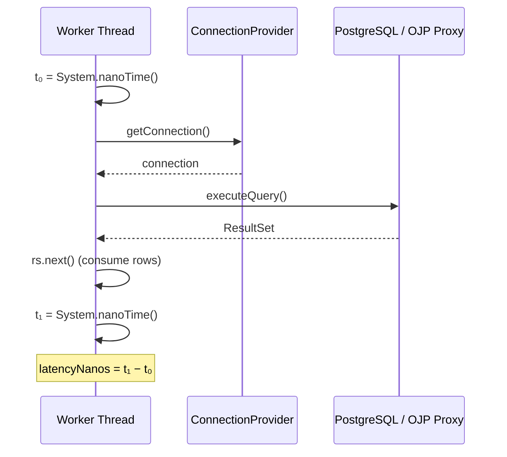
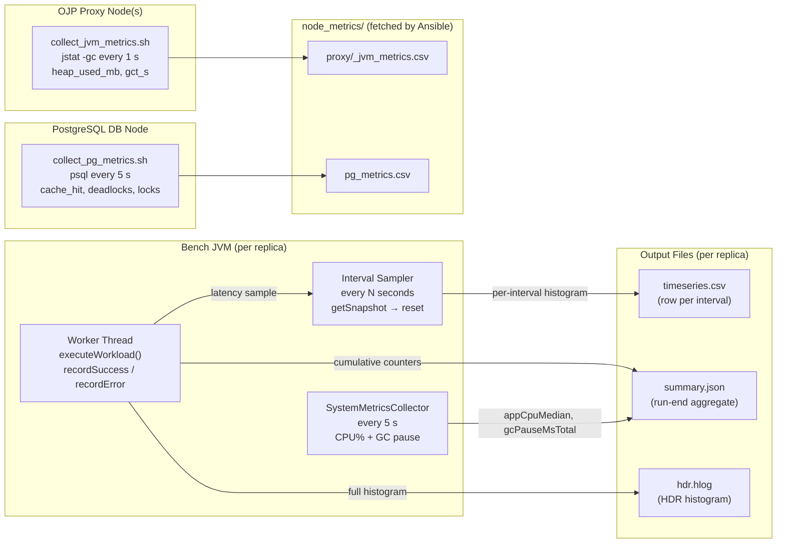
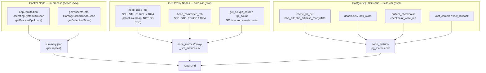

# Metrics Reference — What Is Measured and How

This document describes every metric Stressar collects, the mechanism used to
collect it, the output file it appears in, and how to interpret it across JDBC
workload stress tests.

---

## Table of Contents

1. [Measurement Scope (What the Latency Clock Covers)](#1-measurement-scope)
2. [Collection Pipeline — How Metrics Flow](#2-collection-pipeline)
3. [Output Files](#3-output-files)
   - [timeseries.csv — Per-second metrics](#timeseriescvs)
   - [summary.json — Aggregate metrics](#summaryjson)
   - [hdr.hlog — HDR histogram log](#hdrhlog)
4. [Metric Catalogue — Bench Client (Currently Collected)](#4-metric-catalogue)
   - [Latency metrics](#latency-metrics)
   - [Throughput metrics](#throughput-metrics)
   - [Error metrics](#error-metrics)
   - [Open-loop correctness metrics](#open-loop-correctness-metrics)
   - [OJP-specific metrics](#ojp-specific-metrics)
5. [Node-Level Metrics — Collection Status and Gaps](#5-node-level-metrics)
   - [Bench / control node](#bench--control-node)
   - [OJP proxy node — JVM heap vs OS RSS](#ojp-proxy-node--jvm-heap-vs-os-rss)
   - [PostgreSQL DB node](#postgresql-db-node)
6. [Workload Operations (What Generates Load)](#6-workload-operations)
7. [Environment Snapshot](#7-environment-snapshot)
8. [Multi-Replica Aggregation](#8-multi-replica-aggregation)
9. [Limitations and Known Issues](#9-limitations-and-known-issues)

---

## 1. Measurement Scope

The latency clock covers **everything the application sees**: connection
acquisition from the pool _plus_ the full SQL round-trip, including result-set
consumption.



Source: `LoadGenerator.executeWorkload()` in `src/main/java/com/bench/load/LoadGenerator.java`.

**What is included:** connection-pool wait, TCP round-trip to DB or proxy, query
execution on PostgreSQL, result-set transmission and iteration.

**What is excluded:** JVM scheduling jitter between the dispatcher thread
submitting the task and the worker thread starting it. This overhead is captured
separately as the _scheduling delay_ metric (see §4).

---

## 2. Collection Pipeline



There are **two** `MetricsCollector` instances running in parallel inside each bench JVM:

| Collector                    | Purpose                                                                   | Reset cadence               |
| ---------------------------- | ------------------------------------------------------------------------- | --------------------------- |
| `metrics` (cumulative)       | Tracks totals from warmup-reset onwards; used for `summary.json`.         | After warmup phase.         |
| `intervalMetrics` (interval) | Tracks per-sampling-window values; used for `timeseries.csv` percentiles. | After every row is written. |

Using a per-interval histogram guarantees that `p99` in row _N_ of the CSV reflects
only requests completed in that specific second, not a diluted value across the whole
run. The cumulative histogram in `hdr.hlog` represents the entire steady-state phase.

The sampling interval is controlled by `metricsIntervalSeconds` (default: **1 second**).

Source: `BenchmarkRunner.java`, lines 80–133.

---

## 3. Output Files

### timeseries.csv

Written in real-time during the **steady-state phase only** (warmup and cooldown
are excluded).

| Column          | Unit         | Source                                 |
| --------------- | ------------ | -------------------------------------- |
| `timestamp_iso` | ISO 8601 UTC | Wall clock at time of snapshot         |
| `attempted_rps` | req/s        | Δ(attempted) ÷ Δt since last row       |
| `achieved_rps`  | req/s        | Δ(completed) ÷ Δt since last row       |
| `errors`        | count        | Δ(errors) in this interval             |
| `p50_ms`        | ms           | HdrHistogram p50 — **interval only**   |
| `p95_ms`        | ms           | HdrHistogram p95 — **interval only**   |
| `p99_ms`        | ms           | HdrHistogram p99 — **interval only**   |
| `p999_ms`       | ms           | HdrHistogram p99.9 — **interval only** |
| `max_ms`        | ms           | HdrHistogram max — **interval only**   |

> Percentiles are derived from the **per-interval histogram** that is reset after
> every row. This prevents percentiles from converging toward a run-average over
> time and allows transient spikes to be visible.

File size: ≈ 100–150 bytes/row → ≈ 60–90 KB for a 600 s run per instance.

---

### summary.json

Written once at the end of each `bench run` invocation. Contains the aggregate
view of the entire steady-state phase (warmup excluded, cooldown included up to
the moment the load generator is stopped).

Key fields:

```
runInfo                         — run context (SUT, workload, instance ID, …)
attemptedRps                    — mean attempted RPS over the measurement window
achievedThroughputRps           — backward-compatible alias of successfulThroughputRps
successfulThroughputRps         — mean successful RPS over the measurement window
errorThroughputRps              — mean failed-request RPS over the measurement window
totalThroughputRps              — mean total completed RPS (successful + failed)
errorRate                       — failedRequests / (completedRequests + failedRequests)
latencyMs.{p50,p95,p99,p999,max,mean,meanSuccessful,meanFailed,meanTotal}  — cumulative latency stats
errorsByType.{<ExceptionClassSimpleName>: count, ...}  — error breakdown
appCpuMedian                    — median application CPU % (optional)
appRssMedian                    — median resident set size in MB (optional)
gcPauseMsTotal                  — total JVM GC pause time in ms (optional)
dbActiveConnectionsMedian       — median active backend connections (optional)
queueDepthMax                   — peak connection-pool queue depth (optional)
```

**Open-loop–specific fields** (present when `openLoop: true`):

```
runInfo.openLoopAttemptedOps         — total operations submitted by dispatcher
runInfo.openLoopMissedOpportunities  — send slots skipped because system fell behind
runInfo.openLoopSchedulingDelayMs    — cumulative dispatcher scheduling delay in ms
```

**OJP-specific fields** (present when `connectionMode: OJP`):

```
runInfo.clientPooling                          — always "none" (server-side pooling)
runInfo.ojpVirtualConnectionMode               — PER_WORKER or PER_OPERATION
runInfo.ojpPoolSharing                         — PER_INSTANCE or SHARED
runInfo.clientVirtualConnectionsOpenedTotal    — total virtual connections opened
runInfo.clientVirtualConnectionsMaxConcurrent  — peak concurrent virtual connections
```

Source: `SummaryWriter.java`, `MetricsSnapshot.java`.

---

### hdr.hlog

An HdrHistogram log file covering the entire steady-state phase. Values are stored
in **microseconds** (1 µs resolution, 3 significant digits).

The file can be analysed offline with standard HdrHistogram tooling:

```bash
# View percentile distribution using the HdrHistogram log processor
java -jar HdrHistogram-2.1.12.jar -i results/run-1/hdr.hlog -outputValueUnitRatio 1000

# Or using the online viewer at https://hdrhistogram.github.io/HdrHistogram/plotFiles.html
```

For multi-replica runs, `HistogramAggregator` merges histograms by **adding
counts** (not averaging percentiles), which is the statistically correct way to
combine independent histograms.

Source: `LatencyRecorder.exportToLog()`, `HistogramAggregator.java`.

---

## 4. Metric Catalogue — Bench Client (Currently Collected)

### Latency metrics

| Metric             | Description                                                              | Collection method                                                    |
| ------------------ | ------------------------------------------------------------------------ | -------------------------------------------------------------------- |
| **p50** (median)   | Half of all requests finish faster than this.                            | `HdrHistogram.getValueAtPercentile(50.0)`                            |
| **p95**            | 95 % of requests finish faster. Primary latency SLO threshold (default < 10 s for mixed OLTP + OLAP workloads). | `HdrHistogram.getValueAtPercentile(95.0)`                            |
| **p99**            | 99 % of requests finish faster. Indicates tail behaviour.                | `HdrHistogram.getValueAtPercentile(99.0)`                            |
| **p99.9**          | 99.9 % of requests finish faster. Captures extreme outliers.             | `HdrHistogram.getValueAtPercentile(99.9)`                            |
| **max**            | Worst single latency observed.                                           | `HdrHistogram.getMaxValue()`                                         |
| **meanSuccessful** | Arithmetic mean for successful requests only.                            | `HdrHistogram.getMean()`                                             |
| **meanFailed**     | Arithmetic mean for failed requests only.                                | `sum(failedLatencyNanos) / failedRequests`                           |
| **meanTotal**      | Arithmetic mean across successful + failed requests.                     | `(sum(successLatencyNanos)+sum(failedLatencyNanos)) / totalRequests` |
| **mean**           | Backward-compatible alias for `meanTotal`.                               | same as `meanTotal`                                                  |

All latency values are reported in **milliseconds** in the output files. The
histogram stores values internally in **microseconds** for precision.

The highest trackable latency is **60,000 ms** (60 seconds). Any latency
exceeding this is clamped to the maximum bucket. Values this large indicate a
completely saturated system; normal operating range is well below 1 second.

---

### Throughput metrics

| Metric                    | Description                                                                                                                                                                                   |
| ------------------------- | --------------------------------------------------------------------------------------------------------------------------------------------------------------------------------------------- |
| `attempted_rps`           | Rate at which the dispatcher submitted operations to the worker pool. For open-loop runs this equals `targetRps` under normal conditions; it drops when the dispatcher itself is CPU-limited. |
| `successfulThroughputRps` | Successful requests per second.                                                                                                                                                               |
| `errorThroughputRps`      | Failed requests per second.                                                                                                                                                                   |
| `totalThroughputRps`      | Completed requests per second (`successfulThroughputRps + errorThroughputRps`).                                                                                                               |
| `achievedThroughputRps`   | Backward-compatible alias of `successfulThroughputRps`.                                                                                                                                       |
| `errorRate`               | `failedRequests ÷ (completedRequests + failedRequests)`. SLO threshold: < 0.001 (0.1 %).                                                                                                      |

---

### Error metrics

Errors are classified by the Java exception type caught in `LoadGenerator.executeWorkload()`:

| Key                          | Meaning                                                                                                        |
| ---------------------------- | -------------------------------------------------------------------------------------------------------------- |
| `<ExceptionClassSimpleName>` | Java exception class simple name (for example `SQLTimeoutException`, `PSQLException`, `IllegalStateException`) |

All exceptions are grouped and counted by exception class type only (not by message). Each key appears in `summary.json` under `errorsByType`.

---

### Open-loop correctness metrics

These fields appear in `summary.json > runInfo` when `openLoop: true`.

| Field                         | Description                                                                                                                                                            |
| ----------------------------- | ---------------------------------------------------------------------------------------------------------------------------------------------------------------------- |
| `openLoopAttemptedOps`        | Total send-slots the dispatcher processed.                                                                                                                             |
| `openLoopMissedOpportunities` | Send-slots skipped because `System.nanoTime()` was already past the scheduled send time by more than one interval. A non-zero value means the system is over capacity. |
| `openLoopSchedulingDelayMs`   | Cumulative sum of how many nanoseconds late each dispatch was (divided by 1,000,000 for ms). Captures OS and JVM scheduling jitter.                                    |

The dispatcher uses **absolute time-based scheduling** (`nextSendTimeNanos += intervalNanos`).
When the system falls behind, it records the delay and moves forward — it never
issues a burst of catch-up requests. This is critical for correct open-loop
measurement.

Source: `TrueOpenLoopLoadGenerator.java`.

---

### OJP-specific metrics

| Field                                   | Description                                                                                                                                                               |
| --------------------------------------- | ------------------------------------------------------------------------------------------------------------------------------------------------------------------------- |
| `clientVirtualConnectionsOpenedTotal`   | Total number of virtual JDBC connections opened from this bench instance to the OJP server during the run. High values in `PER_OPERATION` mode indicate connection churn. |
| `clientVirtualConnectionsMaxConcurrent` | Peak number of virtual connections held open simultaneously.                                                                                                              |
| `ojpVirtualConnectionMode`              | `PER_WORKER`: one virtual connection per worker thread (low churn). `PER_OPERATION`: open/close per SQL operation (tests connection setup overhead).                      |
| `ojpPoolSharing`                        | `PER_INSTANCE`: each bench JVM gets its own server-side pool (size = `dbConnectionBudget`). `SHARED`: all replicas share one pool (size = `dbConnectionBudget` total).    |

Source: `OjpProvider.java`, `BenchmarkRunner.java`.

---

## 5. Node-Level Metrics — Collection

The bench client (§4) measures what the _application sees_. The following
metrics are also collected automatically during a run:



---

### Bench / control node (in-process)

These metrics are collected **inside the bench JVM** by `SystemMetricsCollector`
during the steady-state phase only (started after warmup-reset, stopped before
the final snapshot). Results appear in `summary.json` for every replica.

| Field in `summary.json` | Metric                                               | Source                                                                            |
| ----------------------- | ---------------------------------------------------- | --------------------------------------------------------------------------------- |
| `appCpuMedian`          | Median process CPU load (%) during steady-state      | `com.sun.management.OperatingSystemMXBean.getProcessCpuLoad()`, sampled every 5 s |
| `gcPauseMsTotal`        | Total GC pause time (ms) accrued during steady-state | `GarbageCollectorMXBean.getCollectionTime()` delta from steady-state start to end |

Source: `SystemMetricsCollector.java`, wired into `BenchmarkRunner.java`.

---

### CPU metric scopes used in `report.md`

To avoid scope confusion, CPU metrics are reported in three explicit scopes:

- `bench_jvm_cpu` — in-process bench JVM CPU (`appCpuMedian` from `summary.json`).
- `service_cpu` — CPU for the sampled service process tree (`cpu_pct` from `*_proc_metrics.csv`).
- `host_cpu` — host-level CPU busy in core-percent (`host_cpu_pct` from `*_proc_metrics.csv`, `/proc/stat`; 100% = 1 CPU, max ~= NCPU×100).

For proxy tiers, `aligned_peak` is computed as `max_t(sum cpu_pct at timestamp t)` across nodes.
The report also shows `legacy_peak_sum` (sum of each node peak) for backward comparability.

All side-car derived CPU/RSS metrics are restricted to the benchmark steady-state window.

---

### OJP proxy node — JVM heap vs OS RSS

> ⚠️ **Critical distinction for OJP:** Java acquires memory from the OS and
> does **not** return it after GC, so OS RSS (as reported by `ps`/`top`)
> significantly overstates actual memory in use.
> A process showing 2 GB RSS may have only 400 MB of live heap objects.
>
> **`collect_jvm_metrics.sh` uses `jstat -gc`, NOT OS RSS,** to measure actual heap.

The `run_benchmarks_ojp.yml` playbook deploys `ansible/scripts/collect_jvm_metrics.sh`
to each proxy node, starts it in the background before bench replicas begin, stops
it after all replicas finish, and fetches the resulting CSV to
`results/<run_name>/node_metrics/proxy/<host>_jvm_metrics.csv`.

| Column in `_jvm_metrics.csv` | Metric                                    | Formula                                         |
| ---------------------------- | ----------------------------------------- | ----------------------------------------------- |
| `heap_used_mb`               | Actual in-use heap (MB)                   | `(S0U + S1U + EU + OU) / 1024` from `jstat -gc` |
| `heap_committed_mb`          | Committed heap capacity (MB)              | `(S0C + S1C + EC + OC) / 1024` from `jstat -gc` |
| `ygc_count`                  | Young-gen GC event count (cumulative)     | `YGC` field                                     |
| `ygct_s`                     | Young-gen GC time in seconds (cumulative) | `YGCT` field                                    |
| `fgc_count`                  | Full GC event count (cumulative)          | `FGC` field                                     |
| `fgct_s`                     | Full GC time in seconds (cumulative)      | `FGCT` field                                    |
| `gct_s`                      | Total GC time in seconds (cumulative)     | `GCT` field                                     |

The report shows median `heap_used_mb`, median `heap_committed_mb`, and total GC time per proxy host.

---

### PostgreSQL DB node

The `run_benchmarks_ojp.yml` playbook deploys `ansible/scripts/collect_pg_metrics.sh`
to the DB node, starts it before bench replicas, stops it after, and fetches the
CSV to `results/<run_name>/node_metrics/pg_metrics.csv`. PostgreSQL statistics are
reset with `pg_stat_reset()` + `pg_stat_reset_shared('bgwriter')` before each run
to give clean per-run deltas.

| Column in `pg_metrics.csv` | Source view / column       | Why it matters                                                            |
| -------------------------- | -------------------------- | ------------------------------------------------------------------------- |
| `numbackends`              | `pg_stat_database`         | Active backend connections; median reported in report                     |
| `xact_commit`              | `pg_stat_database`         | Cumulative committed transactions; cross-check vs bench RPS               |
| `xact_rollback`            | `pg_stat_database`         | Non-zero → contention or application errors                               |
| `blks_hit` / `blks_read`   | `pg_stat_database`         | Used to compute cache hit ratio                                           |
| `cache_hit_pct`            | computed                   | `blks_hit / (blks_hit + blks_read) × 100`; < 99 % → tune `shared_buffers` |
| `temp_bytes`               | `pg_stat_database`         | Non-zero → sort/hash spills; tune `work_mem`                              |
| `deadlocks`                | `pg_stat_database`         | Should be 0 for OLTP workloads                                            |
| `lock_waits`               | `pg_locks` (instantaneous) | Count of ungranted locks; > 0 → hot-row contention                        |
| `buffers_checkpoint`       | `pg_stat_bgwriter`         | Buffers written by checkpointer; high → WAL/I/O pressure                  |
| `checkpoint_write_ms`      | `pg_stat_bgwriter`         | Cumulative ms spent writing during checkpoints; high → I/O-bound          |

---

## 6. Workload Operations

The SQL executed by each workload type:

### W1_READ_ONLY

| Mix          | SQL                                                                                                                               |
| ------------ | --------------------------------------------------------------------------------------------------------------------------------- |
| 30 % Query A | `SELECT account_id, username, email, full_name, balance_cents, status FROM accounts WHERE account_id = ?`                         |
| 70 % Query B | `SELECT order_id, account_id, created_at, status, total_cents FROM orders WHERE account_id = ? ORDER BY created_at DESC LIMIT 20` |

Each operation opens **one connection** from the pool, executes **one** prepared
statement, and closes the connection.

### W2_READ_WRITE (and W2_MIXED)

The write path is a three-statement **explicit transaction**:

1. `INSERT INTO orders(account_id, created_at, status, total_cents) VALUES (?, ?, 0, 0) RETURNING order_id`
2. `INSERT INTO order_lines(order_id, line_no, item_id, qty, price_cents) SELECT …` — repeated 1–4 times (uniform random)
3. `UPDATE orders SET total_cents = (SELECT COALESCE(SUM(qty * price_cents), …)) WHERE order_id = ?`

`W2_MIXED` mixes W1 reads with W2_READ_WRITE writes at a configurable ratio
(default 80 % read / 20 % write, controlled by `writePercent`).

The **latency clock covers the entire transaction** including the commit.

### W3_SLOW_QUERY

| Mix            | SQL                                                                                                                                          |
| -------------- | -------------------------------------------------------------------------------------------------------------------------------------------- |
| 99 % fast path | Same as W1 Query B                                                                                                                           |
| 1 % slow path  | `SELECT … FROM orders o JOIN order_lines ol … WHERE o.created_at > (CURRENT_TIMESTAMP - INTERVAL '90 days') GROUP BY … ORDER BY … LIMIT 500` |

The slow query is a full JOIN + GROUP BY + ORDER BY on the last 90 days of orders.
This workload is used to evaluate how the proxy tier handles queries of mixed
duration (head-of-line blocking, server-side pool starvation under slow queries).

---

## 7. Environment Snapshot

Running `bench env-snapshot` captures a point-in-time snapshot of the control
node's environment into `results/env/<timestamp>/`:

| File            | Contents                                                                                                                                                                      |
| --------------- | ----------------------------------------------------------------------------------------------------------------------------------------------------------------------------- |
| `snapshot.json` | Machine-readable: OS family/version, CPU model/cores/frequency, total RAM, Java version/vendor/JVM flags, Git commit + branch + dirty flag, dependency versions.              |
| `snapshot.md`   | Human-readable Markdown version of the same data, with placeholder sections for PostgreSQL `postgresql.conf` and PgBouncer `pgbouncer.ini` settings to be filled in manually. |

The snapshot is used for reproducibility: attach it to every published benchmark
result so readers can verify the hardware and software baseline.

Source: `EnvSnapshotCommand.java` (uses [OSHI](https://github.com/oshi/oshi) for
hardware detection).

---

## 8. Multi-Replica Aggregation

When 16 bench JVM replicas run in parallel, each writes its own
`instance_N/summary.json` and `instance_N/hdr.hlog`. Running `bench aggregate`
or `ansible/scripts/generate_report.sh` combines them.

**Correct aggregation for histograms:**
`HistogramAggregator.aggregateHistogramLogs()` merges HDR logs by **adding
histogram bucket counts**. This preserves the true combined distribution. Do not
average percentiles across replicas; that is statistically incorrect.

**Throughput aggregation:**
Total aggregate RPS = sum of `achievedThroughputRps` across all instances.
`generate_report.sh` reports both per-instance mean and aggregate total.

Source: `HistogramAggregator.java`, `ansible/scripts/generate_report.sh`.

---

## 9. Limitations and Known Issues

| #   | Issue                                                                                                                                                                                                                                                                                                 | Impact                                                                                                           |
| --- | ----------------------------------------------------------------------------------------------------------------------------------------------------------------------------------------------------------------------------------------------------------------------------------------------------- | ---------------------------------------------------------------------------------------------------------------- |
| 1   | **Latency clock starts at actual send, not scheduled time.** The gap between when the dispatcher submitted a task and when the worker thread actually started it is not included in the per-operation latency. This gap is tracked as `openLoopSchedulingDelayMs` in aggregate but not per-operation. | Reported latencies may understate end-to-end response time under heavy contention for worker threads.            |
| 2   | **No cross-replica clock synchronisation.** Each bench JVM uses its own `System.currentTimeMillis()` for `timestamp_iso`. Merging timeseries from different machines assumes clocks are within NTP-synchronised bounds (≤ 10 ms drift).                                                               | Timeseries from LG-1 and LG-2 may have small timestamp offsets.                                                  |
| 3   | **`appRssMedian` schema field is not populated and misleading for OJP.** Java holds memory from the OS after GC; OS RSS overstates live heap. The field is retained in the schema for non-JVM SUTs. For OJP, use `heap_used_mb` from the `jstat` side-car CSV (§5).                                   | RSS would have been 2–5× the actual live heap for OJP.                                                           |
| 4   | **OJP server-side pool occupancy and queue depth not yet collected.** These require OJP to expose a management API or JMX MBean.                                                                                                                                                                      | Cannot directly observe server-side back-pressure without OJP instrumentation.                                   |
| 5   | **HDR histogram highest trackable value is 60 s.** Latencies above 60,000 ms are clamped to the max bucket.                                                                                                                                                                                           | Extremely high tail values during catastrophic saturation are reported as 60,000 ms instead of their true value. |

See [TECHNICAL_ANALYSIS.md](TECHNICAL_ANALYSIS.md) for the full 30-question
correctness analysis of the load model and measurement methodology.

---

_See also: [RESULTS_FORMAT.md](RESULTS_FORMAT.md) — full data schemas and file formats._
